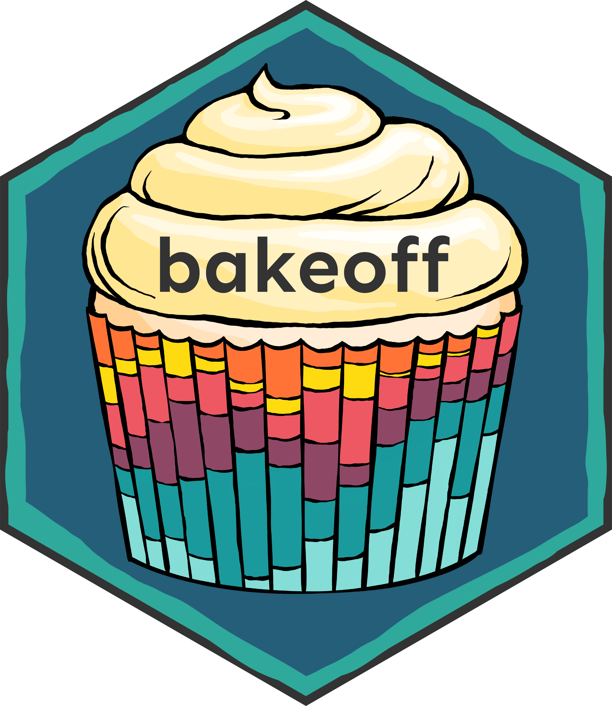
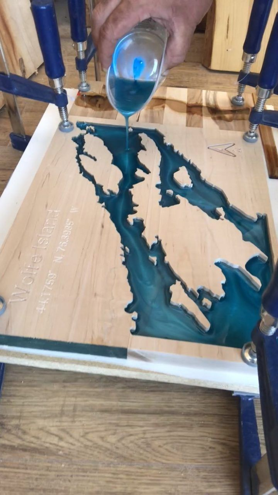

```{r setup, include=FALSE}
library(glue)
library(dplyr)
library(bakeoff)
library(epoxy)
library(xaringanExtra)
xaringanExtra::use_panelset()

knitr::opts_chunk$set(collapse = TRUE)

# from garrick's brain
# https://github.com/gadenbuie/slides/blob/130fac64c5fd293c1ade6f9af796c3fdae8edc2e/toronto-data-workshop/index.Rmd#L53

`%||%` <- function(x, y) if (is.null(x)) y else x

rewrite_chunk <- function(label, include_label = FALSE, nbt = 3) {
  chunk <- knitr::knit_code$get(label)
  opts <- attr(chunk, "chunk_opts")
  bt <- strrep("`", nbt)
  engine <- opts$engine %||% "r"
  exclude <- c("engine")
  if (is.logical(include_label) && !isTRUE(include_label)) {
    exclude <- c(exclude, "label")
  }
  if (is.character(include_label)) {
    label <- include_label
  }
  opts <- opts[setdiff(names(opts), exclude)]
  opts <- paste(
    vapply(names(opts), FUN.VALUE = character(1), function(on) {
      paste0(
        if (on != "label") paste(on, "= "), 
        if (is.character(opts[[on]])) {
          if (on == "label") label else dQuote(opts[[on]], q = 0) 
        } else {
          deparse(opts[[on]])
        }
      )
    }),
    collapse = ", "
  )
  header <- paste0(bt, "{", engine, if (length(opts) && nzchar(opts)) " ", opts, "}")
  paste(
    header,
    paste(chunk, collapse = "\n"),
    bt,
    sep = "\n"
  )
}
```


class: title-slide, right, middle
background-image: url("images/vintage_valentine.jpg")
background-position: left
background-size: contain

.pull-right[

# `r rmarkdown::metadata$title`

## `r rmarkdown::metadata$subtitle`

### `r rmarkdown::metadata$author`

### `r rmarkdown::metadata$date`
]


---
class: middle, center, inverse

## .big-text[Hello.]

???

So hello- I'm so happy to be invited to join you all today.


---
name: hello
class: middle, center, inverse


### `r rmarkdown::metadata$author`


### `r rmarkdown::metadata$role`

### `r rmarkdown::metadata$company`

[`r icon::fa("github")` @apreshill](https://github.com/apreshill)    
[`r icon::fa("twitter")` @apreshill](https://twitter.com/apreshill)   
[`r icon::fa("link")` alison.rbind.io](https://alison.rbind.io)

---
class: middle

.left-column[

]

.right-column[
# On your marks...get set...

```r
remotes::install_github("apreshill/bakeoff")
```

https://bakeoff.netlify.app/
]


---
background-image: url(images/rmarkdown_hedgehog_wide.png)
background-size: contain

---
name: glue
class: middle

.left-column[

]

---
template: glue

.right-column[
# Let's start with glue

```{r}
library(glue)
```

https://glue.tidyverse.org/index.html
]

---
template: glue

.right-column[

# Use glue in chunks

.panelset[
.panel[.panel-name[What you code]
````
```{r results='asis', echo=FALSE}`r ''`
bakers %>% 
  count(series) %>% 
  glue_data("- Series {series} had {n} bakers") %>% 
  glue_collapse(sep = " \ \n")
```
````
]

.panel[.panel-name[What you see]
```{r results='asis', echo=FALSE}
bakers %>% 
  count(series) %>% 
  glue_data("- Series {series} had {n} bakers") %>% 
  glue_collapse(sep = " \ \n")
```
]


]
]

---
template: glue

.right-column[

# Use glue inline

.panelset[
.panel[.panel-name[What you code]
The show has aired on `` `r
glue::glue_collapse(unique(series$channel), sep = ", ", last = ", and ")` ``.

]

.panel[.panel-name[What you see]
The show has aired on `r glue::glue_collapse(unique(series$channel), sep = ", ", last = ", and ")`.
]
]
]

---
name: epoxy
class: middle

.left-column[

]

---
template: epoxy

.right-column[

# Let's level up: epoxy

```r
# install.packages("remotes")
remotes::install_github("gadenbuie/epoxy")
```

```{r}
library(epoxy)
```

Epoxy gives `knitr` a new **engine**.

### Why? 

This helps us meld our data and text in a whole new way.
]

---
template: epoxy

.right-column[

# Fire up the glue engine

.panelset[
.panel[.panel-name[What you code]

````markdown
`r rewrite_chunk("glue-gbbo")`
````


]
.panel[.panel-name[What you see]
```{glue, glue-gbbo}
There are {nrow(bakeoff::series)} series of
 *The Great British Bake-Off* (or, **GBBO**).
```
]
]
]

---
template: epoxy

.right-column[

# Add data

.panelset[
.panel[.panel-name[What you code]

````markdown
`r rewrite_chunk("glue-data")`
````

Choose how vectors are collapsed by adding `*`, `&` or `|` to the end of the expression.

]
.panel[.panel-name[What you see]
```{glue glue-data, data=series, .transformer = epoxy_style_collapse()}
The show has aired on {unique(channel)&}.
```
]
]
]

---
template: epoxy

.right-column[

# The oxford comma way

.panelset[
.panel[.panel-name[What you code]

````markdown
`r rewrite_chunk("glue-comma")`
````

Use `.transformer` to change.

]
.panel[.panel-name[What you see]
```{glue glue-comma, data=series, .transformer = epoxy_style_collapse(last_and = ", and ")}
The show has aired on {unique(channel)&}.
```


]
]
]

---
template: epoxy

.right-column[

# Epoxy is *vectorized*

.panelset[
.panel[.panel-name[Data]

```{r}
bakers %>% 
  count(series)
```
]
.panel[.panel-name[What you code]

````markdown
`r rewrite_chunk("glue-bakers")`
````
]

.panel[.panel-name[What you see]


```{glue glue-bakers, data = bakers %>% count(series)}
- **Series {series}**: {n} bakers
```

]
]
]

---
background-image: url("images/kitten-box.png")
background-position: right
background-size: contain
class: middle, center, inverse

.pull-left[

# What about parameters?
]

---
name: parameters

# The parameters two-step

.pull-left[

1\. Setup in YAML with `params:`

```{r echo=FALSE, comment=NULL}
library(ymlthis)
yml_empty() %>% 
  yml_params(date = "February 14",
             send_to = list(value = list(first = "Annetha", last = "Mills")),
             sent_from = list(value = list(first = "Alison", last = "Hill")))
```
]

---
template: parameters

--

.pull-right[
```{r}
params$date
params$send_to
params$sent_from
```

]

---
template: parameters

--

.pull-right[
2\. Use in code with `params$field_name`

Valentine's Day is 
`` `r
params$date`` `

```{r eval=FALSE}
baker_results %>% 
  filter(baker_first == params$send_to$first & 
           baker_last == params$send_to$last)
```

]

---
template: parameters

--

.pull-right[
2\. Use in code with epoxy!

```{glue glue-date, data=params}
### To (sent {date}):
```

```{glue glue-to, data=params$send_to}
{first} {last}
```

```{glue glue-from, data=params$sent_from}
### From:
{first} {last}
```

]


---
template: parameters


.pull-right[
2\. Use in code with epoxy!

````markdown
`r rewrite_chunk("glue-date")`
````

````markdown
`r rewrite_chunk("glue-to")`
````

````markdown
`r rewrite_chunk("glue-from")`
````

]


---
class: middle

# Two main flavors of parameterized reports

--

.pull-left[

+ .emphasis[Scoped:] a report made with a single source, but with different variants scoped for different audiences.

+ .emphasis[Change:] narrative; .emphasis[Keep:] data

    &rarr; `ceo.html`

    &rarr; `lnl.html`
  

]

--

.pull-right[

+ .emphasis[Filtered:] a report made with a single source but the dataset is filtered to focus on a specific subsample or time period.

+ .emphasis[Change:] data; .emphasis[Keep:] narrative

    &rarr; `nw-covid-august.html`

    &rarr; `se-covid-july.html`
    
]
  
---
class: middle

# Two main modes for rendering parameterized reports

--

.pull-left[

+ .emphasis[Single:] you just want to render one-at-a-time. You can use vanilla knit button, a Shiny interactive interface, or command line.

]

--

.pull-right[

+ .emphasis[Batch:] you want to render many reports, iterating across all values of a parameter. You can use command line, or customize your `r emo::ji("yarn")` button.

]

---
background-image: url("images/kitten-theater.png")
background-position: right
background-size: contain
class: middle, center, inverse

.pull-left[

# The parameter finale
]
---

# Use parameters inside your YAML metadata

```{r echo=FALSE, comment=NULL}
yml_empty() %>% 
  yml_title("A valentine for `r params$send_to$first`") %>% 
  yml_subtitle("Yours truly, `r params$sent_from$first`") %>% 
  yml_params(date = "February 14",
             send_to = list(value = list(first = "Annetha", last = "Mills")),
             sent_from = list(value = list(first = "Alison", last = "Hill")))
```


---

# Use parameters to override your YAML

`_render_single.R`

```r
function(input, ...) {
  purrr::walk(
    .x = list(send_to = list(first = "Sophie", last = "Faldo")),
    ~ rmarkdown::render(
      input = input,
      output_file = glue::glue("valentine-for-{.x$first}.html"),
      params = list(send_to = {.x},
                    sent_from = list(first = "Rami", last = "Krispin"))
    )
  )
}
```

---

# Use parameters to override your YAML metadata


---

# Change what knit button does

.pull-left[

### Add your R script

Recommended: name it `_render.R`, and it .emphasis[must] be of the form:

```r
function(input, ...) { 
...
}
```
]

--

.pull-right[

### Add to YAML with `knit:` key

`source` your script, and you .emphasis[must] end this with `$value`

```{r echo=FALSE, comment=NULL}
yml_empty() %>% 
  yml_toplevel(knit = "source('_render.R')$value")
```

]


---
name: goodbye
class: inverse, bottom

.pull-left[
Sincere thanks to my RStudio colleagues:
+ Christophe Dervieux, 
+ Garrick Aden-Buie, and 
+ Tom Mock.
]


.pull-right[
.right[


# Thank you!

### Find me at...

[`r icon::fa("twitter")` @apreshill](http://twitter.com/apreshill)  
[`r icon::fa("github")` @apreshill](http://github.com/apreshill)  
[`r icon::fa("link")` alison.rbind.io](https://alison.rbind.io)  
]
]