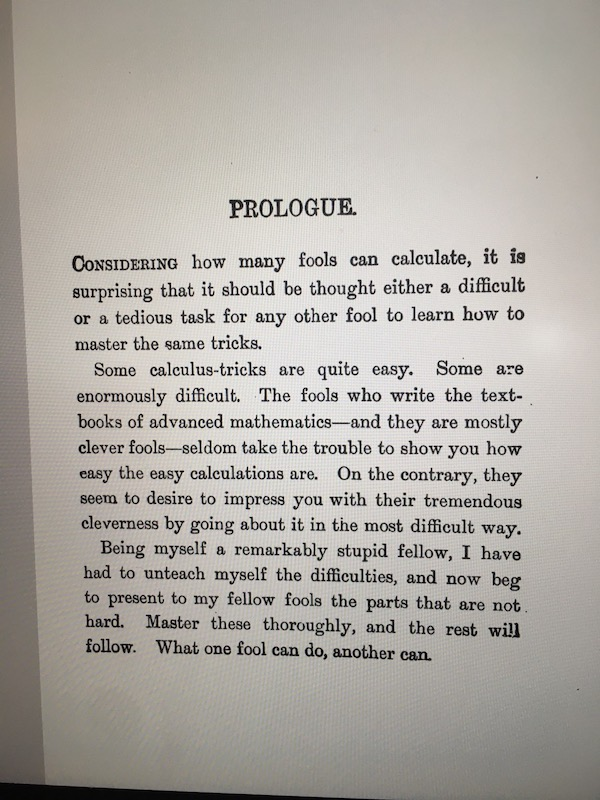

```{r setup, include=FALSE}
knitr::opts_chunk$set(fig.path="figs/", echo=FALSE, warning=FALSE, message=FALSE, fig.retina=3, fig.asp=.5, out.width='100%', fig.showtext = TRUE, comment = NULL)

# for cran plots
library(cranlogs)
library(tidyverse)

# for fonts
library(showtext)
font_add_google("Bitter", "Bitter")
showtext_auto()
theme_set(theme_minimal(base_family = "Bitter"))

# for colors
pkg_colors <- c("palmerpenguins" = "#7899d4", 
                "blogdown" = "#f5ab1f", 
                "distill" = "#b74f6f")

library(xaringanExtra)
xaringanExtra::use_panelset()
```


class: title-slide, left, middle
background-image: url("images/chimp.jpg")
background-position: right
background-size: contain
background-color: #7899d4ff

.pull-left[

# `r rmarkdown::metadata$title`

## `r rmarkdown::metadata$subtitle`

### `r rmarkdown::metadata$author`

### `r rmarkdown::metadata$date`
]


---
class: middle, center, inverse

## .big-text[Hello.]

???

So hello- I'm so happy to be invited to join you all today.


---
name: hello
class: middle, center, inverse


### `r rmarkdown::metadata$author`


### `r rmarkdown::metadata$role`

### `r rmarkdown::metadata$company`

[`r fontawesome::fa("github")` @apreshill](https://github.com/apreshill)    
[`r fontawesome::fa("twitter")` @apreshill](https://twitter.com/apreshill)   
[`r fontawesome::fa("link")` alison.rbind.io](https://alison.rbind.io)

---
class: section, middle, center

.frame[
# In the beginning...
]

--

# There were tools.

---
background-image: url(images/stone-tools.jpg)
background-size: cover

.footnote[[Source](https://commons.wikimedia.org/wiki/File:Ancient_Greece_Neolithic_Stone_Tools_%26_Weapons.jpg)]

???

But tools don't just exist in a vacuum. To be a tool, it must be used.

---
name: zinda
background-image: url(images/zinda.jpg)
background-position: right
background-size: contain
class: middle

---
template: zinda

.pull-left[

> "In October, 1960, Dr. Goodall watched as a chimpanzee bent a twig, stripped off it leaves, and used it to “fish” termites from their nest. Up until her moment of discovery, the ability to make and use tools had been considered uniquely human."
> 
> [janegoodall.org](https://janegoodall.org/our-story/our-legacy-of-science/)

]

---
template: zinda

.pull-left[

> "Now we must redefine 'tool', redefine 'man', or accept chimpanzees as humans."
> 
> Louis B. Leakey

]

???

And actually, this is something that was a seminal observation in other species- using tools.

---
class: center, inverse, middle

# How do we define 'tool'?

--


---
class: middle
background-image: url(images/tools.png)
background-position: right
background-size: 50%
background-color: white

# What is a tool?

--

.pull-left[
> A thing&mdash;anything&mdash;that can be used to get a job done. To achieve a goal.
]


.footnote[Image from [NYT](https://www.nytimes.com/2007/02/13/science/13chim.html)]

???

We don't use tools inherently because the tool is fun to use, although that is nice side effect when it happens. And when we have a choice of tools, that matters. 

But like the chimpanzee, we mainly want to get a job done.

---
background-image: url(images/04-09-17-Chimpanzees.png)
background-position: top
class: bottom, center, inverse
background-color: #7899d4

#### Defining, and deciphering, how chimps teach each other to use tools

.footnote[[Source](https://2newthings.com/defining-deciphering-how-chimps-teach-use-tools/)]

---
background-image: url(images/01-29-18-New-Caledonian-crow-using-a-hooked-stick.png)
background-position: top
class: bottom, center, inverse
background-color: #7899d4

#### New Caledonian crows’ clearly profit from the care and craftsmanship they put into their tools

.footnote[[Source](https://2newthings.com/new-caledonian-crows-clearly-profit-care-craftsmanship-put-tools/)]

---
class: section, middle, center

.frame[
# And then...
]

--

## Humans made software tools for other humans to use.

---
background-image: url(images/black-hole.jpg)
background-size: contain
background-position: left
class: middle, inverse, right

.pull-right[
# Sometimes it goes well...
]

--


.footnote[
Katie Bouman, courtesy of [PBS](https://www.pbs.org/newshour/science/katie-bouman-hardly-knew-what-a-black-hole-was-her-algorithm-helped-us-see-one)
]
---
class: center, inverse, middle

# Sometimes it does not go well.

--


---

pivot to software

what is the difference?

You may be thinking of yourself more as a tool-user

But today I want you to think about yourself as the tool-maker

Is it kind? What makes a tool kind?

Does it matter?

---
class: middle, monkey-slide, inverse

# Social learning

--

> "Learning that is influenced by observation of, or interaction with, another animal (typically a conspecific) **or its products**" 

--

.footnote[[Box, 1984](https://www.google.com/books/edition/Primate_Behaviour_and_Social_Ecology/bAwrBgAAQBAJ?hl=en&gbpv=1&pg=PR7&printsec=frontcover); [Heyes, 1994](users.ox.ac.uk/~ascch/Celia's pdfs/3 1994 Heyes cats and mechs.pdf)]

---
background-image: url(images/work.png)
background-size: cover
class: top, center

## .big-text[Wait, this is social learning?]

---
name: takeaway
background-image: url(images/takeout.jpg)
background-size: contain
background-position: left

---
name: takeaway1
template: takeaway
class: middle, inverse

.pull-right[
# Take aways
]

--

.pull-right[
### Learning to use a tool made by someone is social.
]

--

.pull-right[
### Making a tool that will be used by someone is social.
]


---
background-image: url(images/cat-expert.jpg)
background-size: contain
background-position: left
class: right, middle, inverse

## .big-text[Expert in social]

good place to add in that triadic image here

.footnote[[Source](https://jasonstcyr.com/2019/11/27/building-trust-have-you-been-kind-today/)]

---

## A warning

Selective social learning, or selective trust, 

---
background-image: url(images/sciam.jpg)
background-position: right
background-size: 50%
class: middle

Tools can shape how you:

--

+ think

--

+ feel

--

+ act

--

+ react


--

.footnote[Illustration by Thomas Pitilli for [*Scientific American*](https://www.scientificamerican.com/article/monkeys-make-stone-ldquo-tools-rdquo-that-bear-a-striking-resemblance-to-early-human-artifacts/)
]

---

Cultural transmission

---

Because humans

---

learning = emotions

---

# You may have heard about this

Managing cognitive load? +- 7 items

learner/user personas

How about managing emotional load


---

Hot vs cool contexts

https://idlab.ucmerced.edu/sites/idlab.ucmerced.edu/files/page/documents/walle_lopez_castillo_in_press.pdf

---

Contrary to cool tasks, hot EF tasks require regulation in contexts where the outcomes are of greater personal significance, such as completing a task to earn a desirable prize(e.g., Hongwanishkul et al., 2005; Kerr & Zelazo, 2004). 

---

Sound familiar? job to be done!

---
class: section, middle, center

.frame[
# Bringing the `r emo::ji("fire")`
]

--

# Teaching tidymodels to *beginners*

---
background-image: url(images/tidymodels-workshop.png)
background-size: contain

.footnote[[Source](https://alison.rbind.io/project/tidyml/)]

---
background-image: url(images/fire.jpg)
background-size: cover
class: middle

.pull-left[
> Much more understandable than online documentation of tidymodels, which should be set on FIRE
]

---
background-image: url(images/fire.jpg)
background-size: cover
class: center, middle

<iframe width="712" height="400" src="https://www.youtube.com/embed/k1oXx4delIY?start=28" title="YouTube video player" frameborder="0" allow="accelerometer; autoplay; clipboard-write; encrypted-media; gyroscope; picture-in-picture" allowfullscreen></iframe>

---
class: section, middle, center

.frame[
# <i class="far fa-paper-plane"></i>
]

--

# Your job to be done:

--

# Be the airplane

---
template: takeaway
class: middle, inverse

.pull-right[
# Take aways
]

--

.pull-right[
### "Cool" = decontextualized and non-emotional.
]

--

.pull-right[
### "Hot" = high personal motivation and greater significance.
] 

--

.pull-right[
They bring `r emo::ji("fire")`; you bring `r emo::ji("snowflake")`
]


---

#How do you not add heat?


I think the answer is kindness

---
class: center, inverse, middle

<iframe width="560" height="315" src="https://www.youtube.com/embed/YGSj2zY2OEM?start=70" title="YouTube video player" frameborder="0" allow="accelerometer; autoplay; clipboard-write; encrypted-media; gyroscope; picture-in-picture" allowfullscreen></iframe>

---
background-image: url(images/rogers-kind.jpg)
background-size: cover

.footnote[[Source](https://jasonstcyr.com/2019/11/27/building-trust-have-you-been-kind-today/)]

---
But what is a kind tool? (not a kind tool maker)

I think it might involve these elements:

---
class: section, middle, center
background-image: url(images/penguins_cran.png)
background-size: 15%
background-position: bottom, center

.frame[
# Be their ally
]

--


## Case study #1: `palmerpenguins`

???

credible -> trust; use expertise effect here "I'm an expert"; examples/case studies build the case- people want you to show not tell


---
class: middle, center

```{r cran-line}
dl <- cranlogs::cran_downloads(c("palmerpenguins", "distill", "blogdown"),
                               from = "2020-04-01",
                               to = "2021-04-07") %>% 
  as_tibble() 

ggplot(dl, aes(date, count, 
               color = fct_reorder2(package, date, count))) +
  geom_line() +
  labs(y = "Daily downloads", color = "package", x = NULL) +
  scale_color_manual(values = pkg_colors)
```

---

```{r cran-median}
weekly_median <-
  dl %>% 
  group_by(week = lubridate::week(date), package) %>% 
  summarize(median_dl = median(count),
            begin_week = min(date))

ggplot(weekly_median, aes(begin_week, median_dl, 
               color = fct_reorder2(package, begin_week, median_dl))) +
  geom_line(lwd = 1) +
  labs(y = "Median weekly downloads", color = "package", x = NULL) +
  scale_color_manual(values = pkg_colors)
```

---

```{r cran-trend}
# from https://github.com/hadley/cran-downloads/blob/master/server.R
show_trend <- function(df) {
  count_ts <- ts(df$count, frequency = 7)
  stl <- tryCatch(
    as.data.frame(stl(count_ts, "periodic")$time.series),
    error = function(e) data.frame(trend = df$count, remainder = 0)
  )

  df$trend <- stl$trend
  df$remainder <- stl$remainder
  df
}

trend <- dl %>% group_by(package) %>% do(show_trend(.))

ggplot(trend, aes(date, colour = fct_reorder2(package, date, count))) +
  geom_linerange(aes(ymin = trend, ymax = trend + remainder), colour = "grey70", alpha = .5, lwd = 1) +
  geom_line(aes(y = trend), lwd = 1) +
  labs(y = "Daily downloads (smoothed)", color = "package", x = NULL) +
  scale_color_manual(values = pkg_colors)
```


---
name: penguins
background-image: url(images/penguins.png)
background-position: left
background-size: 50%
class: middle

---
template: penguins

.pull-right[

We set out to make a data package that was:

1. Friendly

1. Approachable

1. Fun

]

---
template: penguins

.pull-right[

The palmerpenguins data package

1. [Friendly docs](https://allisonhorst.github.io/palmerpenguins/)

1. [Approachable license](https://allisonhorst.github.io/palmerpenguins/LICENSE.html)

1. [Fun art](https://allisonhorst.github.io/palmerpenguins/articles/art.html)

And of course, the charismatic penguins themselves!

]


---

.pull-left[
```{r echo=FALSE}
palmerpenguins::penguins %>% 
  as.data.frame()
```

]

--

.pull-right[
```{r echo=FALSE}
palmerpenguins::penguins 
```

]

---

We learn better from 'ingroup' members:

> Babies as young as 14 months will prefer to imitate the novel actions of people who speak their own language, over a foreign-language speaker.

.footnote[https://pubmed.ncbi.nlm.nih.gov/33203741/; https://pubmed.ncbi.nlm.nih.gov/23006251/; https://pubmed.ncbi.nlm.nih.gov/21159092/]

---

.pull-left[

]


.pull-right[

]

.footnote[[tweet](https://twitter.com/helenczerski/status/1375915057905856513?s=20)]
---


4 anticipate (rational -> trust; use smarties task here; what is the "job to be done"- hilarious snickers user persona) --> DISTILL THEMER + POSTCARDS (led to new collections feature)

---
class: top, center
background-image: url(images/blogdown.jpg)
background-size: 63%
background-position: bottom, center

.frame[
# Case study #2: `blogdown`
]

???


3 acknowledge (reliable -> trust; is there a "credible" effect here "I'm a reliable expert"; what is hard is hard, what you think is easy...is "easy"?) blogdown checks

---

```{r cran-cum}
cumulative_dl <- 
  dl %>% 
  group_by(package) %>% 
  mutate(cum_dl = cumsum(count)) %>% 
  ungroup()

ggplot(cumulative_dl, 
       aes(date, 
           cum_dl, 
           color = fct_reorder2(package, date, cum_dl)
           )
       ) +
  geom_line(lwd = 1) +
  labs(y = "Cumulative downloads (past year)", color = "package", x = NULL) +
  scale_color_manual(values = pkg_colors) +
  scale_x_continuous(expand = c(0, 0)) +
  scale_y_continuous(sec.axis = 
                       sec_axis(~ ., 
                                breaks = 
                                  filter(cumulative_dl, date == max(date)) %>% 
                                  pull(cum_dl)))
```


---
class: middle, center

# What is hard about blogdown?

--

[I asked this in 2018](https://community.rstudio.com/t/what-is-hard-about-blogdown/8108/24).

--

I was *really* wrong. 

--

What is really hard about blogdown is that it is scary.


---
class: center, inverse, middle

# Alison troubleshooting blogdown sites


---
class: middle, center

<blockquote class="twitter-tweet"><p lang="en" dir="ltr">blogdown users have suffered from two main pain points: 1. Hugo versions; 2. Themes. We have fixed #1, and will also try to fix #2. I have to admit that #1 was partly my fault (was aware of the pain but didn&#39;t provide solution). #2 requires more effort but is still fixable.</p>&mdash; Yihui Xie (@xieyihui) <a href="https://twitter.com/xieyihui/status/1374075636562673664?ref_src=twsrc%5Etfw">March 22, 2021</a></blockquote> <script async src="https://platform.twitter.com/widgets.js" charset="utf-8"></script> 

---
class: section, middle, center

.frame[
# Be their accomplice
]


---
class: middle

# `r emo::ji("airplane")` Pre-flight checks

```{r eval=FALSE, echo=TRUE}
library(blogdown)

# kitchen sink
check_site()

# one at a time
check_config()
check_gitignore()
check_hugo()
check_netlify()
check_content()
```

--

.footnote[[PR](https://github.com/rstudio/blogdown/pull/534); [issue](https://github.com/rstudio/blogdown/issues/510); [post](https://alison.rbind.io/post/2020-12-27-blogdown-checks/)]

---
class: middle

.panelset[
.panel[.panel-name[Before]

```{.r}
blogdown:::serve_site()

--------------------------------------------------------------------------------
You are recommended to ignore more items in the 'ignoreFiles' field in config.toml: "\\.Rmd$", "\\.Rmarkdown$", "\\.knit\\.md$", "\\.utf8\\.md$"
--------------------------------------------------------------------------------
--------------------------------------------------------------------------------
You are recommended to remove the item '_files$' in the 'ignoreFiles' field in config.toml.
--------------------------------------------------------------------------------
```

]

.panel[.panel-name[Check]

```{.r}
blogdown::check_config()

― Checking config.toml
| Checking "baseURL" setting for Hugo...
○ Found baseURL = "https://alison.rbind.io"; nothing to do here!
| Checking "ignoreFiles" setting for Hugo...
● [TODO] Add these items to the "ignoreFiles" setting: "\\.Rmd$", "\\.Rmarkdown$", "\\.knit\\.md$", "\\.utf8\\.md$"
| Checking setting for Hugo's Markdown renderer...
○ All set! Found the "unsafe" setting for goldmark.
― Check complete: config.toml
```
]
]

---
class: middle

.panelset[
.panel[.panel-name[Before]

```{.r}
The 'publish' setting in 'netlify.toml' is 'public/' but the publish dir in the Hugo config file is 'public'. You may want to change the former to the latter.
```

]

.panel[.panel-name[Check]

```{.r}
blogdown::check_netlify()

― Checking netlify.toml...
○ Found HUGO_VERSION = 0.79.0 in [build] context of netlify.toml.
| Checking that Netlify & local Hugo versions match...
○ It's a match! Blogdown and Netlify are using the same Hugo version (0.79.0).
| Checking that Netlify & local Hugo publish directories match...
○ Good to go - blogdown and Netlify are using the same publish directory: public
― Check complete: netlify.toml
```
]
]

---
class: middle

.panelset[
.panel[.panel-name[Before]

```{.r}
The date of the post is in the future: '2025-01-01'. See https://github.com/rstudio/blogdown/issues/377 for consequences.
To turn off this warning, set options(blogdown.warn.future = FALSE).
```
]


.panel[.panel-name[Check]

```{.r}
blogdown::check_content()

― Checking content files
| Checking for previewed content that will not be published...
● [TODO] Found 1 file with a future publish date:

  content/talk/2021-rstudio-global/index.md

  If you want to publish today, change a file's YAML key to 'date: 2020-12-27'
○ Found 0 files marked as drafts.
| Checking your R Markdown content...
○ All R Markdown files have been knitted.
○ All R Markdown output files are up to date with their source files.
| Checking for .html/.md files to clean up...
○ Found 0 duplicate .html output files.
○ Found 0 incompatible .html files to clean up.
― Check complete: Content
```
]
]

---

# Kind design?

> "In Japan and Korea, the ○ mark is used instead of the check mark, and the X or ✓ mark are commonly used for wrong."
>
> [Wikipedia](https://en.wikipedia.org/wiki/Check_mark)

--

.pull-left[
`○` = `check_success()` 

`●` = `[TODO]`
]

--

.pull-right[

`―` = start/complete check

`|` = progress

And we managed to avoid ✗ shapes, which always port you back to 5th grade math.
]

---
class: middle

> I can understand exactly what's being checked, I'm able to follow along with what's going on behind the scenes with each step, and I understand what I need to do next. What a difference! These messages are so much more helpful and clear -- I am so impressed!

--

> Really enjoy the encouraging console output that accompanies the new blogdown::check_site() function.

--

> I can't get over how great all the checks are in the new version of #blogdown. Wow. #RStats

--

> Also blogdown::check_site() is a lifesaver for debugging your site

--

> A friend of mine recently ran blogdown::check_config() and thanks to the messaging was able to fix some critical things that had been causing her (and me, by association!) some major confusion and headaches. Hurray! 

--

> I feel empowered to continue using blogdown 


---
class: section, middle, center
background-image: url(images/distill.png)
background-size: 15%
background-position: bottom, center

.frame[
# Be their assistant
]

--

# Case study #3: `distill` + `postcards`

---
class: center, inverse, middle

# Alison testing Hugo themes


---
name: postcard
background-image: url(images/postcard.jpg)
background-size: 50%
background-color: white
background-position: left
class: middle

---
template: postcard

.pull-right[

> “Create simple, beautiful personal websites and landing pages using only R Markdown.”
>
> [Sean Kross](https://github.com/seankross/postcards)

]

---
template: postcard

.pull-right[

Distill is a package that *also* helps you make simple, beautiful websites and blogs using only R Markdown.

Distill + postcards are [M-F-E-O](https://alison.rbind.io/post/2020-12-22-postcards-distill/)

]


---
name: goodbye
class: bottom

.pull-left[
### Sincere thanks to:
+ Allison Horst,
+ Kristen Gorman,
+ JJ Allaire,
+ Christophe Dervieux, 
+ Hadley Wickham, and 
+ Yihui Xie.
]


.pull-right[
.right[


# Thank you!

### Find me at...

[`r fontawesome::fa("twitter")` @apreshill](http://twitter.com/apreshill)  
[`r fontawesome::fa("github")` @apreshill](http://github.com/apreshill)  
[`r fontawesome::fa("link")` alison.rbind.io](https://alison.rbind.io)  
]
]

```{r include=FALSE}
library(metathis)
meta() %>%
  meta_description(
    "Crafting kind tools."
  ) %>% 
  meta_name("github-repo" = "apreshill/talks") %>% 
  meta_viewport() %>% 
  meta_social(
    title = "Crafting kind tools",
    url = "https://alison.netlify.app/ares-kind-tools",
    image = "https://alison.netlify.app/rmd-valentine/images/vintage_valentine.jpg",
    image_alt = "Vintage valentine",
    og_type = "website",
    og_author = "Alison Hill",
    twitter_card_type = "summary",
    twitter_creator = "@apreshill"
  )
```

