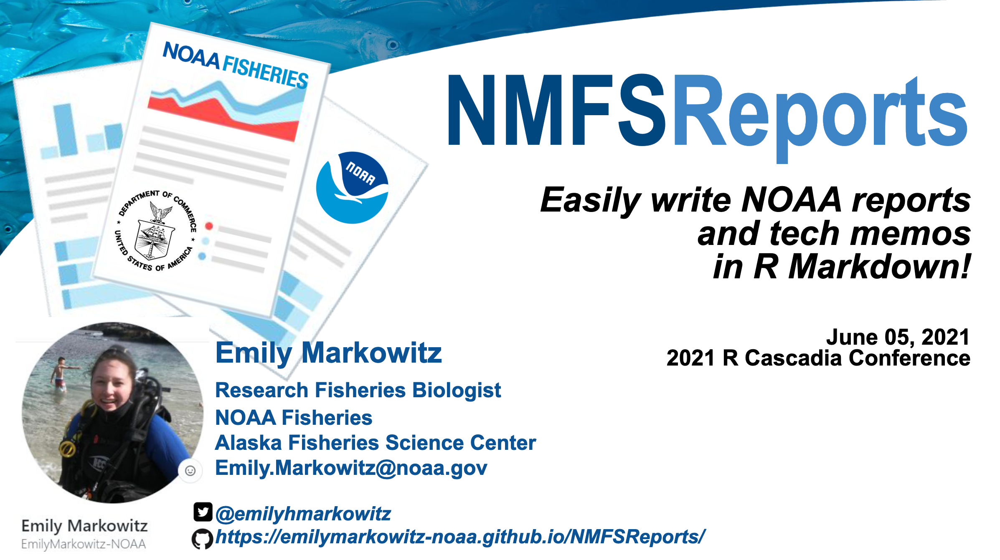
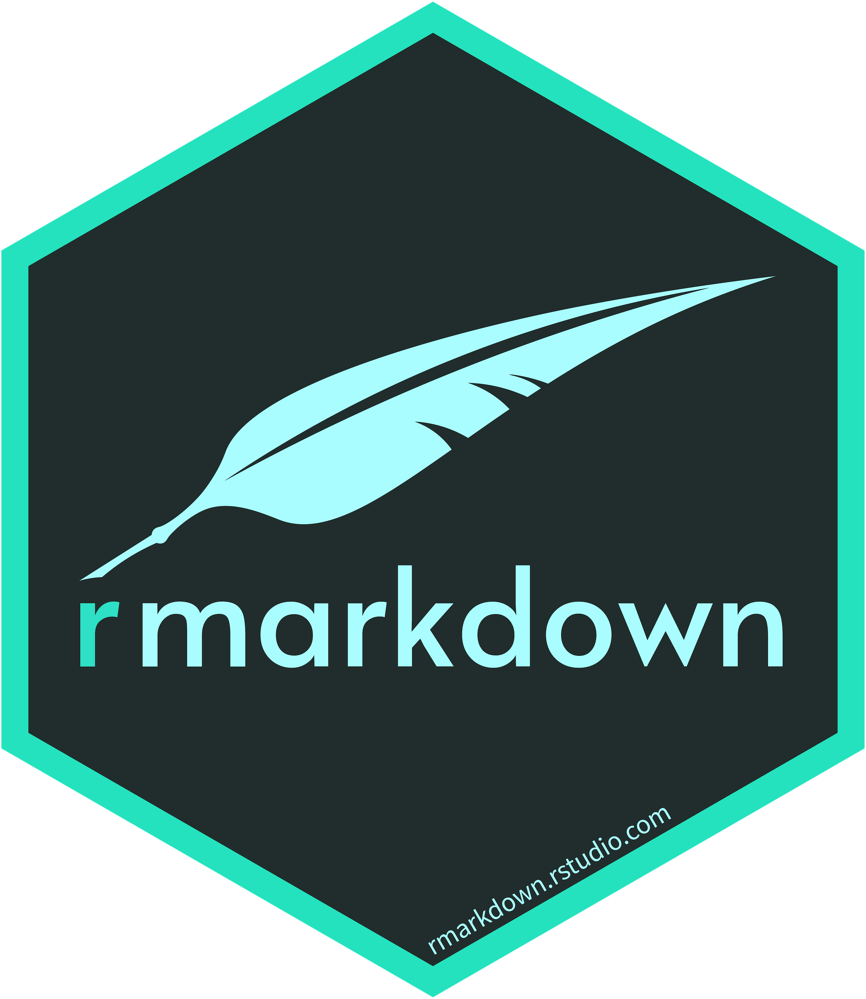

class: title-slide, left, middle
background-image: url("images/rmd-hex.png")
background-position: 85% 50%
background-size: 30%
background-color: #F9F8F3

.pull-left[

# `r rmarkdown::metadata$title`

### `r rmarkdown::metadata$author`, Ph.D.

### `r rmarkdown::metadata$org`

### `r rmarkdown::metadata$date`
]


---
class: middle, center, inverse

## .big-text[Hello.]


---
name: hello
class: middle, center, inverse


### `r rmarkdown::metadata$author`


### `r rmarkdown::metadata$role`

### `r rmarkdown::metadata$org`

[`r fontawesome::fa("github")` @apreshill](https://github.com/apreshill)    
[`r fontawesome::fa("twitter")` @apreshill](https://twitter.com/apreshill)   
[`r fontawesome::fa("link")` alison.rbind.io](https://alison.rbind.io)

---
class: middle, center

# Who we are

.columns[

.left-col[
### `r rmarkdown::metadata$author`


[`r fontawesome::fa("github")` @apreshill](https://github.com/apreshill)    
[`r fontawesome::fa("twitter")` @apreshill](https://twitter.com/apreshill)   
[`r fontawesome::fa("link")` alison.rbind.io](https://alison.rbind.io)
]

.middle-col[
### Christophe Dervieux


[`r fontawesome::fa("github")` @cderv](https://github.com/cderv)    
[`r fontawesome::fa("twitter")` @chrisderv](https://twitter.com/chrisderv)   
]


.right-col[
### Yihui Xie


[`r fontawesome::fa("github")` @yihui](https://github.com/yihui)    
[`r fontawesome::fa("twitter")` @xieyihui](https://twitter.com/xieyihui)   
[`r fontawesome::fa("link")` yihui.org](https://yihui.org/)
]
]

---
class: middle
background-image: url(images/hexes.png)
background-position: left
background-size: contain

.pull-right[

# We develop & support R packages for data science communication.

]

---
class: bottom center
background-image: url(images/projs.png)
background-position: 50% 10%
background-size: 70%

## .big-text[Write. Code. Share. Repeat.]


---
class: top, center
background-image: url(images/rmd_flowchart.png)
background-position: 50% 50%
background-size: 100%

# How it works

---
class: top center
background-image: url(images/fauna.png)
background-position: 50% 90%
background-size: 50%

# Who uses it?

--

.pull-left[
.center[
Researchers
]
]

--

.pull-right[
.center[
Data Scientists
]
]


---
class: middle
background-image: url(images/knit.png)
background-position: 90% 50%
background-size: 25%

# How do they use it?

--

+ Scientific communication 


--

+ Team collaboration

--

+ Teaching (& learning) out loud


---
class: middle

# Scientific communication 

```{r echo=FALSE}
knitr::include_url("https://stats.andrewheiss.com/who-cares-about-crackdowns/", height = 450)
```

.footnote[https://stats.andrewheiss.com/who-cares-about-crackdowns/]

---
class: middle


# Scientific communication 

```{r echo=FALSE}
knitr::include_url("https://skadauke.github.io/early-toci/" , height = 450)
```

.footnote[https://skadauke.github.io/early-toci/]

---
class: middle


# Collaboration

```{r echo=FALSE}
knitr::include_url("https://www.openscapes.org/" , height = 450)
```

.footnote[https://www.openscapes.org/]

---
class: middle


# Collaboration

```{r echo=FALSE, out.width="75%"}

```

.footnote[https://emilymarkowitz-noaa.github.io/NMFSReports/]

---
class: middle


# Teaching (& learning) out loud

```{r echo=FALSE}
knitr::include_url("https://rmd4sci.njtierney.com/" , height = 450)
```

.footnote[https://rmd4sci.njtierney.com/]


---
class: middle


# Teaching (& learning) out loud

```{r echo=FALSE}
knitr::include_url("https://numbat.space/post/pca/pca/" , height = 450)
```

.footnote[https://numbat.space/post/pca/pca/]


---
class: middle
background-image: url(images/draft.png)
background-position: 95% 50%
background-size: 45%

# Community


https://community.rstudio.com/tag/rmarkdown

https://twitter.com/hashtag/rmarkdown

[Contributing Guide](https://pkgs.rstudio.com/rmarkdown/CONTRIBUTING.html)

---
name: goodbye
class: bottom
background-image: url("images/fam.png")
background-size: 40%
background-position: 1% 99%

.pull-left[
### Our extended family:
+ Garrick Aden-Buie,
+ Carson Sievert,
+ Charles Teague,
+ Hadley Wickham, 
+ JJ Allaire, and
+ Rich Iannone.

*All illustrations by [Allison Horst](https://www.allisonhorst.com/).*
]


.pull-right[
.right[



# Thank you!

### Find us elsewhere at...

[`r fontawesome::fa("link")` rmarkdown.rstudio.com](https://rmarkdown.rstudio.com)  
[`r fontawesome::fa("stroopwafel")` rmarkdown cookbook](https://bookdown.org/yihui/rmarkdown-cookbook/)  
[`r fontawesome::fa("blog")` blog.rstudio.com](https://blog.rstudio.com/categories/r-markdown/)  
[`r fontawesome::fa("box-open")` pkgs.rstudio.com](https://pkgs.rstudio.com/)  
[`r fontawesome::fa("youtube")` youtube](https://youtube.com/playlist?list=PL9HYL-VRX0oTZhAhlLb8r6DI04KY46RJW) 
]
]
