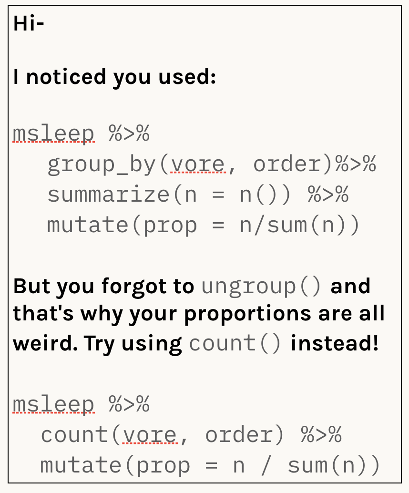
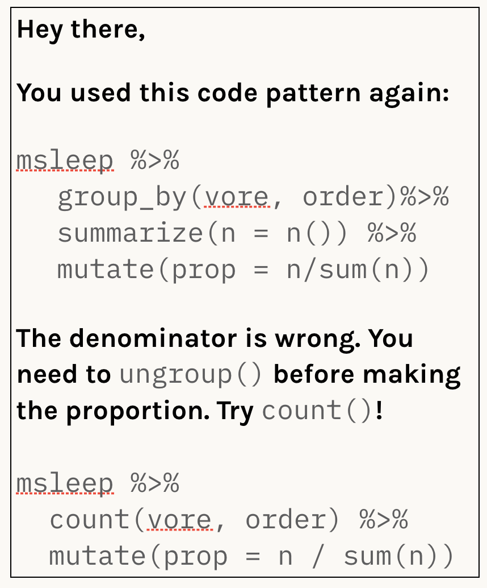
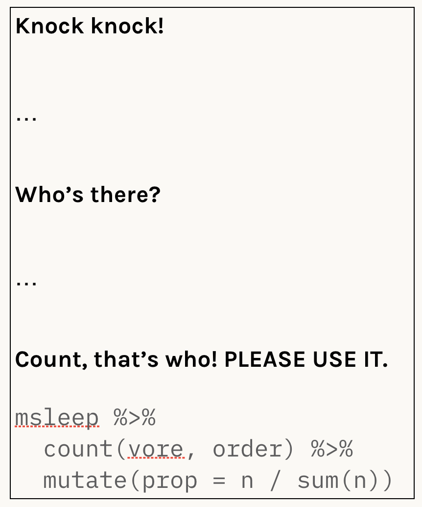
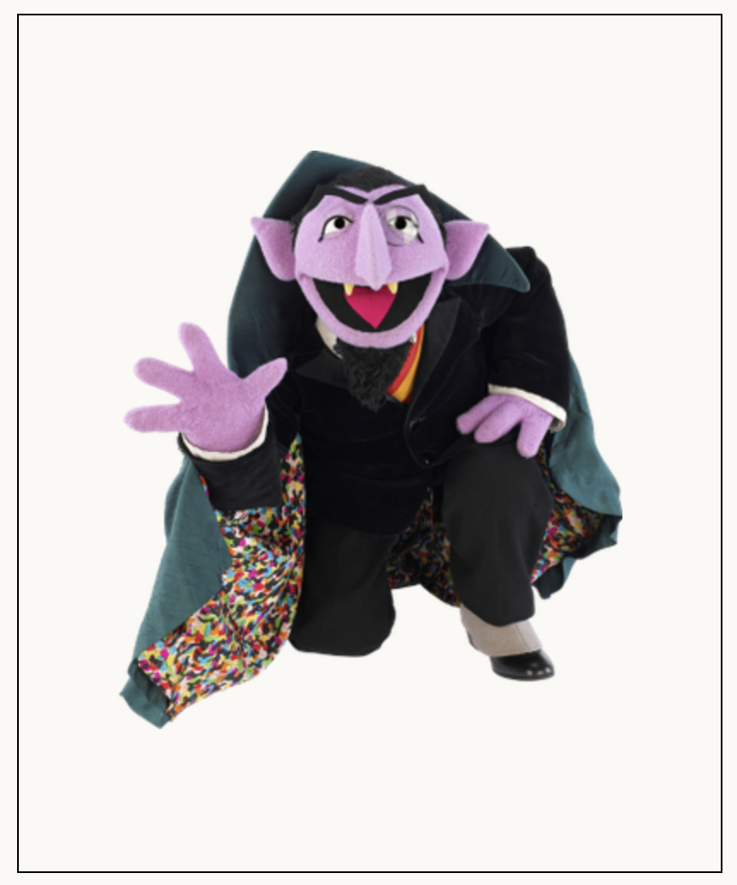
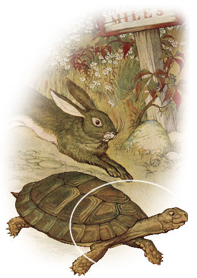
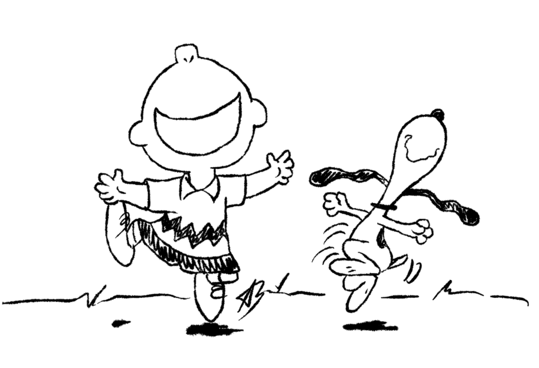
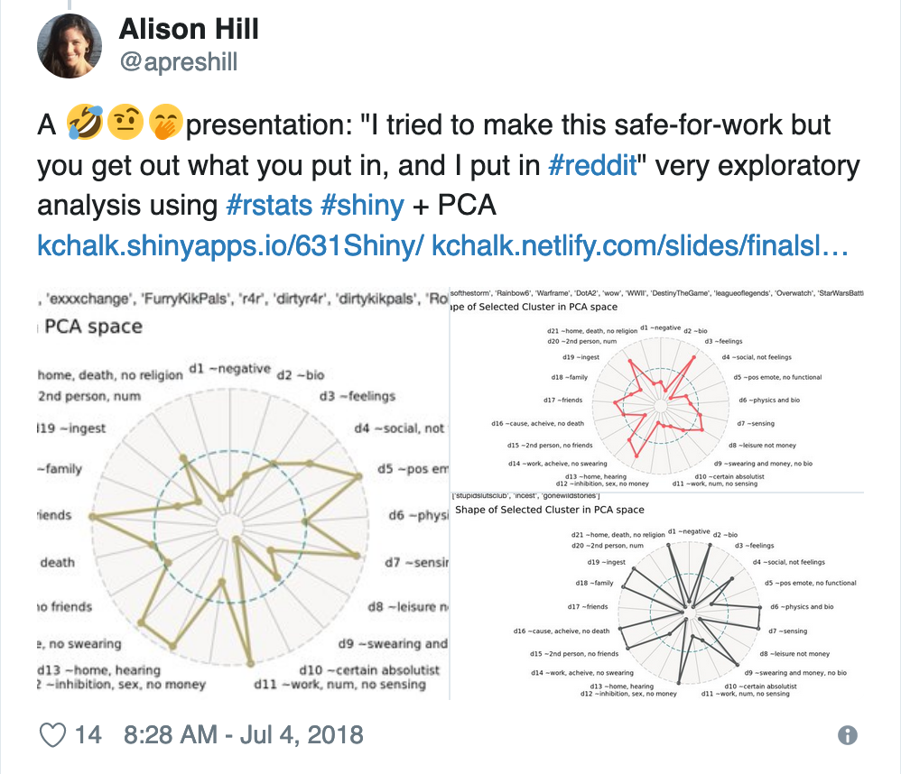

```{r setup, include=FALSE}
options(htmltools.dir.version = FALSE)
knitr::opts_chunk$set(warning = FALSE, message = FALSE, 
  comment = NA, dpi = 300, echo = FALSE,
  fig.align = "center", out.width = "80%", cache = FALSE)
library(tidyverse)
library(wesanderson)
library(gganimate)
```

class: inverse, title-slide
background-image: url(img/ilyass-seddoug-c4lXkCHuaXY-unsplash.jpg)
background-size: cover

# `r rmarkdown::metadata$title`


.footnote[
### `r rmarkdown::metadata$author`, Ph.D.
### Data Scientist & Professional Educator
#### rstd.io/talkingds-jsm<br>

]

???

Hi- 

My name is Alison Hill and I am a data scientist and professional educator for RStudio.

Before that, I was an assistant then associate professor at Oregon Health & Science University,

Where I developed and taught three data science courses, mainly using R.

Today I wanted to share with you some of the strategies I developed over 8 years of teaching

So that I could not only teach my students to learn a new programming language like R,

but also learn to speak the language of data science at the same time.


---
name: hello
class: inverse, right, bottom


# Find me at...

[`r icon::fa("twitter")` @apreshill](http://twitter.com/apreshill)  
[`r icon::fa("github")` @apreshill](http://github.com/apreshill)  
[`r icon::fa("link")` alison.rbind.io](https://alison.rbind.io)  
[`r icon::fa("paper-plane")` alison@rstudio.com](mailto:alison@rstudio.com)

???

Here is my contact information.

I love talking about this stuff so please find me around at the conference to talk about any and all things R, RStudio, R Markdown + education!

---
background-image: url(img/can-answer.png)
background-size: cover

???

So you all may know learners like this.

You can ask them focused questions on an assignment, and they do fine. 

Maybe even great.

---
background-image: url(img/can-present.png)
background-size: cover

???

Then you may ask them to present their work.

Also fine.

Maybe even great.

---
background-image: url(img/can-connect.png)
background-size: cover

???

Then comes the Q&A, or maybe you hear about a job interview they had.

As a former language researcher,

I like to compare this to learning the semantics versus pragmatics of language.


---
class: middle, center


# Semantics versus pragmatics


<center>
<blockquote class="twitter-tweet"><p lang="en" dir="ltr">A: Your greatest weakness?<br>B: Interpreting semantics of a question but ignoring the pragmatics<br>A: Could you give an example?<br>B: Yes, I could</p>&mdash; Gary &quot;鯨理&quot; Illyes (@methode) <a href="https://twitter.com/methode/status/768337146780475392?ref_src=twsrc%5Etfw">August 24, 2016</a></blockquote>
</center>

???

So semantics is concerned with getting vocabulary and meaning correct.

But pragmatics is all about language use in real life.

And to get a job, to engage with and contribute to the
data science community, learners need pragmatics.

So how did I start getting them there?


---
class: center, middle

# Problem #1

--

I made beautiful answer keys for my homework assignments . . .

--

That no one read . . .

--

Maybe the best students did . . .

--

But that meant the ones who needed to read them the most . . .

--

did not.

---
class: middle, center

<div class="row">
  <div class="column">
    <h2>Homework 1</h2>
    
  </div>
  
--

  <div class="column">
    <h2>Homework 2</h2>
    
  </div>
  
--

  <div class="column">
    <h2>Homework 3</h2>
    
  </div>

--

  <div class="column">
    <h2>Homework 4</h2>
    
  </div>
</div>


---
class: middle, center

# Problem #1

No one used the answer keys to learn.

--

<hr>

# Solution #1


I gave away my answer keys.

???

So my problem was that no one used my answer keys for learning.

But that wasn't their fault- I hadn't made them into a learning tool.

My solution was to give them away, and make them into a usable learning tool. 
And I did that by requiring...

---
name: self
class: inverse, center, middle

# Self-reflection

???

Self reflection

So what did that look like, and how did I still do grading?


---
class: middle, center

<div class="row">
  <div class="column-5">
    <h1 style="font-size:1em;">Initial solution</h1>
  </div>
  <div class="column-5">
    <h1 style="font-size:1em;">&nbsp;</h1>
  </div>
  <div class="column-5">
    <h1 style="font-size:1em;">Answer key given</h1>
  </div>
  <div class="column-5">
    <h1 style="font-size:1em;">&nbsp;</h1>
  </div>
  <div class="column-5">
    <h1 style="font-size:1em;">Self-assessment</h1>
  </div>
</div>

<div class="row">
  <div class="column-5">
    <h1 style="font-size:5em;">`r emo::ji("inbox_tray")`</h1>
  </div>
  <div class="column-5">
    <h1 style="font-size:5em;">&xrarr;</h1>
  </div>
  <div class="column-5">
    <h1 style="font-size:5em;">`r emo::ji("old_key")`</h1>
  </div>
  <div class="column-5">
    <h1 style="font-size:5em;">&xrarr;</h1>
  </div>
  <div class="column-5">
    <h1 style="font-size:5em;">`r emo::ji("dart")`</h1>
  </div>
</div>

--

<div class="row">
  <div class="column-5">
    <span style="font-size:3em;">&#8673;</span>
  </div>
  <div class="column-5">
    <span style="font-size:3em;">&nbsp;</span>
  </div>
  <div class="column-5">
    <span style="font-size:3em;">&nbsp;</span>
  </div>
  <div class="column-5">
    <span style="font-size:3em;">&nbsp;</span>
  </div>
  <div class="column-5">
    <span style="font-size:3em;">&#8673;</span>
  </div>
</div>

<div class="row">
  <div class="column-5">
    <span style="font-size:1em;font-family: Arapey;">Was the initial solution a good faith effort?<br><br>
    (`0` / `1` / `2` points)
    </span>
  </div>
  <div class="column-5">
    <span style="font-size:3em;">&nbsp;</span>
  </div>
  <div class="column-5">
    <span style="font-size:3em;">&nbsp;</span>
  </div>
  <div class="column-5">
    <span style="font-size:3em;">&nbsp;</span>
  </div>
  <div class="column-5">
    <span style="font-size:1em;font-family: Arapey;">Did you catch all (or most) of your own errors in your self-assessment? <br><br>
    Is your (updated) solution correct? <br><br>
    (`0` / `1` / `2` / `3` points)
    </span>
  </div>
</div>

???

The truth is, providing the answer keys or feedback at the end is not actually
helpful for learners.

Students have high motivation and set aside time for what matters for their grade, 
not necessarily their learning.

So it's no surprise that motivation was low and time was limited for students
to devote to "extracurricular" learning.

---
exclude: true

Inspired by [Hal Daume](https://docs.google.com/presentation/d/1AL4WIGN6ti3uuIE-XgMQqQpLXijlVIeskI_D5ZxN80Q/edit#slide=id.g10749fb5e7_0_60), I started grading based on self-assessments. Here was my final rubric: (link to it)


---
class: middle, center

## How to succeed while really trying

--

.pull-left[
Submit a perfectly accurate <br> initial solution.

```{r echo = FALSE, out.width="50%"}
knitr::include_graphics("img/the-hare.jpeg")
```

]

--

.pull-right[
"I found the same results as the answer key.   
.callout[Bada bing, bada boom]."
]

---
class: middle, center

## How to succeed while really trying

.pull-left[
Submit a perfectly accurate <br> self-assessment.

```{r echo = FALSE, out.width="50%"}

```
]

.pull-right[
"Well, well, well. I was .callout[really confused] about interaction effects."

"Gah! I didn't .callout[actually understand] the null hypothesis here."

"I .callout[forgot] to set a seed for my permutation test, so now I see why my results kept changing!" 
]


???

Given that you put in an initial "good faith" effort here...


---
name: sample
class: middle, center


# What I read

---
template: sample

"Most of my code matches the answer key - there were only one or two sections where I didn’t make the correct plot or write the correct code for the desired output, but I think a good portion of my narrative was accurate, .callout[which is encouraging]."

---
template: sample

"After doing this self-assessment, I’m realizing that I had a .callout[better grasp] on this analysis than I had previously thought. I made a couple small errors, but after seeing the answer key, I think I understood .callout[why] I made them and .callout[how to avoid] those errors in the future. "


---
template: sample
"I liked that the self-assessment allowed me to see where I was .callout[close] and what parts I was .callout[really far off]."

---
template: sample

"I found that, while generating this model was straightforward, .callout[interpretation] of the results was more difficult than I expected."

---
class: middle, center

# What happened

--

They actually .callout[read] my answer keys.

--

They learned to .callout[read & write] `code`.

--

They learned to .callout[read & write] about `code`.

--

They learned to .callout[read & write] about data science.


```{r snoopy_dance, echo = FALSE, out.width = "25%"}

```

---
template: self

---
name: self-talk
class: center, middle
background-image: url(img/self-talk.png)
background-size: cover


---
class: center, middle

# Problem #2

--

Make code work &larrhk;

--

Turn it in &larrhk;

--

.callout[Do self-assessment & receive grade &larrhk;]

--

Never ever ever (EVER) look at your code again &larrhk;

--

Rinse and repeat &larrhk;

???

So they would accumulate these piles of possibilities.

But they would never look back and learn from them.

Instead, I think from one assignment to the next they felt like this...

---
class: middle, center


---
class: middle, center

# Problem #2

Sad plots, orphaned code, missed growth opportunities.

--

<hr>

# Solution #2


I made them make it .callout[better].

---
class: center, middle, inverse

# Iteration

---
class: center, middle, inverse

# ~~Iteration~~

## Take some sad `r icon::fa("code")` or `r icon::fa("chart-bar")` <br>

## and make it better

???

Take some sad plots/code and make them better


---

# What did this look like?

In my data visualization class:

+ Recruit army of ~8 `r icon::fa("r-project")` pros (course instructors plus past students)

+ Get students to pick out 2-3 plots that were `r emo::ji("heavy_check_mark")` but `r emo::ji("disappointed")`


---
class: middle, center

# What happened

--

They learned to .callout[listen & talk] `code`.

--

They learned to .callout[listen & talk] about `code`.

--

They learned to .callout[listen & talk] about data science.

--

They got actual code .callout[help], not .callout[feedback]

```{r ref.label='snoopy_dance', echo = FALSE, out.width = "25%"}
```

---
template: self-talk

---
name: peer-talk
class: center, middle
background-image: url(img/peer-talk.png)
background-size: cover

???

The next step was to talk instead to a real person in real time

A person who was there to help you, not evaluate you

---
class: inverse, center, middle

# Broadcasting

???

Broadcasting is my last strategy, and this one wasn't developed in response
to a problem.
As a parent to a toddler, reminiscent of advice to "sportscast"

---
class: inverse, middle, center

.pull-left[

```{r echo = FALSE}

```

]

.pull-right[
<blockquote class="twitter-tweet"><p lang="en" dir="ltr">We just wrapped our <a href="https://twitter.com/hashtag/dataviz?src=hash&amp;ref_src=twsrc%5Etfw">#dataviz</a> class and I want to share some awesome plots from some 💯 student projects (with permission 😉)<br>Please RT to support new learners 🙏🏽 <a href="https://twitter.com/hashtag/rstats?src=hash&amp;ref_src=twsrc%5Etfw">#rstats</a> <a href="https://twitter.com/hashtag/ggplot2?src=hash&amp;ref_src=twsrc%5Etfw">#ggplot2</a></p>&mdash; Alison Hill (@apreshill) <a href="https://twitter.com/apreshill/status/1014531287485333506?ref_src=twsrc%5Etfw">July 4, 2018</a></blockquote>
]


---
class: inverse, middle, center

.pull-left[

```{r echo = FALSE}

```

].pull-right[
<blockquote class="twitter-tweet"><p lang="en" dir="ltr">REALLY great atmosphere of inquiry, reflection, and open discussion of graphics &amp; data analysis strategies with <a href="https://twitter.com/apreshill?ref_src=twsrc%5Etfw">@apreshill</a>&#39;s students <a href="https://twitter.com/alexandra_em?ref_src=twsrc%5Etfw">@alexandra_em</a>, <a href="https://twitter.com/_opelr?ref_src=twsrc%5Etfw">@_opelr</a>, <a href="https://twitter.com/graceolawley?ref_src=twsrc%5Etfw">@graceolawley</a>, <a href="https://twitter.com/alexandracsalem?ref_src=twsrc%5Etfw">@alexandracsalem</a> at the <a href="https://twitter.com/pdxrlang?ref_src=twsrc%5Etfw">@pdxrlang</a> <a href="https://twitter.com/hashtag/rstats?src=hash&amp;ref_src=twsrc%5Etfw">#rstats</a> Meetup last night! THANKS!</p>&mdash; John David Smith (@smithjd) <a href="https://twitter.com/smithjd/status/1029759688487854080?ref_src=twsrc%5Etfw">August 15, 2018</a></blockquote> 
]


---
class: inverse, middle, center

.pull-left[
<blockquote class="twitter-tweet"><p lang="en" dir="ltr">A sentimental analysis of Tolstoy <a href="https://twitter.com/alexandracsalem?ref_src=twsrc%5Etfw">@alexandracsalem</a> <a href="https://t.co/lHvGY6KwcU">https://t.co/lHvGY6KwcU</a> <a href="https://twitter.com/hashtag/rstats?src=hash&amp;ref_src=twsrc%5Etfw">#rstats</a> <a href="https://twitter.com/hashtag/ggplot2?src=hash&amp;ref_src=twsrc%5Etfw">#ggplot2</a> <a href="https://twitter.com/hashtag/xaringan?src=hash&amp;ref_src=twsrc%5Etfw">#xaringan</a> from <a href="https://twitter.com/pdxrlang?ref_src=twsrc%5Etfw">@pdxrlang</a> <a href="https://t.co/LyIcXb4ZfN">pic.twitter.com/LyIcXb4ZfN</a></p>&mdash; Alison Hill (@apreshill) <a href="https://twitter.com/apreshill/status/1029547097404493824?ref_src=twsrc%5Etfw">August 15, 2018</a></blockquote> 
]

--

.pull-right[
<blockquote class="twitter-tweet"><p lang="en" dir="ltr">Sole Mates: Analysis of Nike’s <a href="https://twitter.com/BIKETOWNpdx?ref_src=twsrc%5Etfw">@BIKETOWNpdx</a> Sneaker Bikes by <a href="https://twitter.com/_opelr?ref_src=twsrc%5Etfw">@_opelr</a> <a href="https://twitter.com/hashtag/rstats?src=hash&amp;ref_src=twsrc%5Etfw">#rstats</a> <a href="https://twitter.com/hashtag/ggplot2?src=hash&amp;ref_src=twsrc%5Etfw">#ggplot2</a> <a href="https://twitter.com/hashtag/xaringan?src=hash&amp;ref_src=twsrc%5Etfw">#xaringan</a> <a href="https://t.co/DxNOXVOFuQ">https://t.co/DxNOXVOFuQ</a> from <a href="https://twitter.com/pdxrlang?ref_src=twsrc%5Etfw">@pdxrlang</a> <a href="https://t.co/cDWwMSoQ0G">pic.twitter.com/cDWwMSoQ0G</a></p>&mdash; Alison Hill (@apreshill) <a href="https://twitter.com/apreshill/status/1029554571897524224?ref_src=twsrc%5Etfw">August 15, 2018</a></blockquote>
]

---
class: inverse, middle, center

.pull-left[
<blockquote class="twitter-tweet"><p lang="en" dir="ltr">Such good Q &amp; A I forgot to tweet!! What’s up with Colorado water basin usage? <a href="https://twitter.com/alexandra_em?ref_src=twsrc%5Etfw">@alexandra_em</a> <a href="https://twitter.com/hashtag/rstats?src=hash&amp;ref_src=twsrc%5Etfw">#rstats</a> <a href="https://twitter.com/hashtag/ggplot2?src=hash&amp;ref_src=twsrc%5Etfw">#ggplot2</a> <a href="https://twitter.com/hashtag/xaringan?src=hash&amp;ref_src=twsrc%5Etfw">#xaringan</a> <a href="https://t.co/wwpBUJaeJO">https://t.co/wwpBUJaeJO</a> from <a href="https://twitter.com/pdxrlang?ref_src=twsrc%5Etfw">@pdxrlang</a> <a href="https://t.co/7vRKuVEUGI">pic.twitter.com/7vRKuVEUGI</a></p>&mdash; Alison Hill (@apreshill) <a href="https://twitter.com/apreshill/status/1029568569632153601?ref_src=twsrc%5Etfw">August 15, 2018</a></blockquote>
]

--

.pull-right[
<blockquote class="twitter-tweet"><p lang="en" dir="ltr">Sentiment analysis of a CHILDES corpus <a href="https://twitter.com/graceolawley?ref_src=twsrc%5Etfw">@graceolawley</a> <a href="https://twitter.com/hashtag/rstats?src=hash&amp;ref_src=twsrc%5Etfw">#rstats</a> <a href="https://twitter.com/hashtag/ggplot2?src=hash&amp;ref_src=twsrc%5Etfw">#ggplot2</a> <a href="https://twitter.com/hashtag/xaringan?src=hash&amp;ref_src=twsrc%5Etfw">#xaringan</a> <a href="https://t.co/212d3Dk5EE">https://t.co/212d3Dk5EE</a> from <a href="https://twitter.com/pdxrlang?ref_src=twsrc%5Etfw">@pdxrlang</a> <a href="https://t.co/uKubbHmyRe">pic.twitter.com/uKubbHmyRe</a></p>&mdash; Alison Hill (@apreshill) <a href="https://twitter.com/apreshill/status/1029550481922830336?ref_src=twsrc%5Etfw">August 15, 2018</a></blockquote>  
]

---
class: middle, center

# What happened

--

They learned to .callout[share a data science project] with the community.

--

They learned to .callout[respond to questions] from the community.

--

They learned to .callout[hear feedback] from the community.

--

They learned to have a .callout[data science dialogue] with the community.

```{r ref.label='snoopy_dance', echo = FALSE, out.width = "25%"}
```

---
background-image: url(img/pragmatics.png)
background-size: cover

---
template: self-talk

---
template: peer-talk

---
name: community-talk
class: center, middle
background-image: url(img/community-talk.png)
background-size: cover

???

I think being intentional about:

setting up the tone for talking about data science

setting up safe sandboxes for talking about data science

and setting up grading systems to support talking about data science

All of these things are things that instructors can do to

create more well rounded data scientists...

---
name: full-circle
class: center, middle
background-image: url(img/full-circle.png)
background-size: cover


???

Those who I hope will be more likely to stay for awhile.

---
name: thanks
background-image: url(img/heart-inverse.png)
background-size: cover
class: middle, right, inverse


# Thank you!

[`r icon::fa("twitter")` @apreshill](http://twitter.com/apreshill)  
[`r icon::fa("github")` @apreshill](http://github.com/apreshill)  
[`r icon::fa("link")` alison.rbind.io](https://alison.rbind.io)  
[`r icon::fa("paper-plane")` alison@rstudio.com](mailto:alison@rstudio.com)  
[`r icon::fa("laptop-code")` slides](https://rstd.io/talkingds-jsm)  
[`r icon::fa("code")` code for slides](https://github.com/apreshill/talks)  
[`r icon::fa("camera-retro")` graphics](https://vecteezy.com)  
[`r icon::fa("users")` humaans](https://www.humaaans.com/) 


???

Thank you!