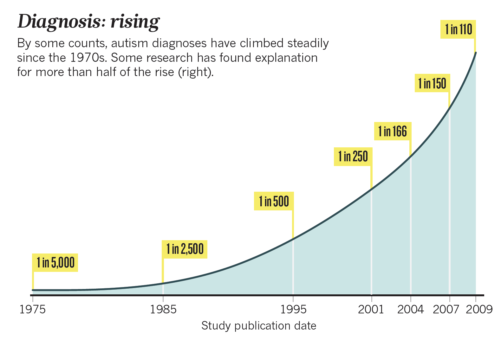
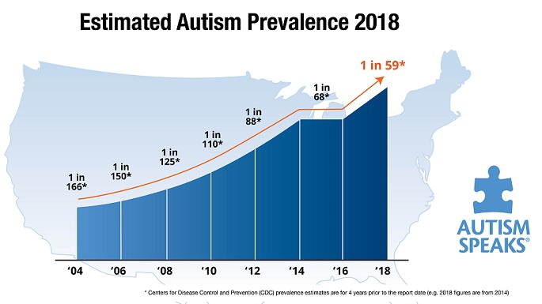
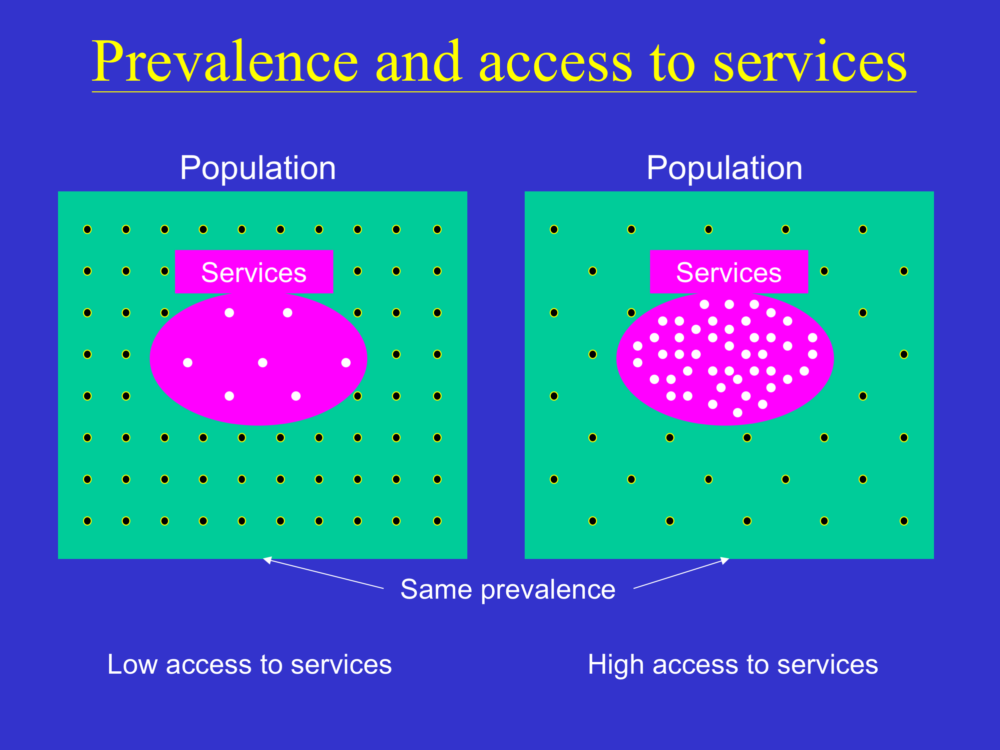

```{r setup, include=FALSE}
options(htmltools.dir.version = FALSE)
knitr::opts_chunk$set(warning = FALSE, message = FALSE, 
  comment = NA, dpi = 300, echo = FALSE,
  fig.align = "center", out.width = "60%", cache = FALSE,
  fig.path = "figs/")
library(tidyverse)
library(gganimate)
ozcols <- wesanderson::wes_palette("FantasticFox1")[c(2:3)]
```

class: title-slide, center, bottom


# `r rmarkdown::metadata$title`

## `r rmarkdown::metadata$subtitle`

### `r rmarkdown::metadata$author` &#183; RStudio

#### `r params$event` &#183; `r params$date`

---
name: hello
class: inverse, right, bottom


# Find me at...

[`r icon::fa("twitter")` @apreshill](http://twitter.com/apreshill)  
[`r icon::fa("github")` @apreshill](http://github.com/apreshill)  
[`r icon::fa("link")` alison.rbind.io](https://alison.rbind.io)  
[`r icon::fa("paper-plane")` alison@rstudio.com](mailto:alison@rstudio.com)

---
background-image: url(images/aim-here.png)
background-size: contain

---
background-image: url(images/feature-keepgoing-hi-rectangle.jpg)
background-size: cover
---
class: inverse, middle, center

# Autism prevalence 


```{r, out.width= '50%'}
knitr::include_graphics("images/number-with-autistic-spectrum-disorder.png")
```


.footnote[
https://ourworldindata.org/neurodevelopmental-disorders
]

---
class: inverse, middle, center

# Autism prevalence 


```{r, out.width= '50%'}

```

.footnote[[Nature](https://www.nature.com/articles/479022a)]
---
class: inverse, middle, center

# Autism prevalence 


```{r, out.width= '50%'}

```

.footnote[[Autism Speaks](https://www.autismspeaks.org/science-news/cdc-increases-estimate-autisms-prevalence-15-percent-1-59-children)]
---
class: inverse, top, center

# California: 1931 to 2014


```{r, out.width= '50%'}
knitr::include_graphics("https://media.springernature.com/lw785/springer-static/image/art%3A10.1007%2Fs10803-018-3670-2/MediaObjects/10803_2018_3670_Fig7_HTML.gif")
```


.footnote[
https://doi.org/10.1007/s10803-018-3670-2
]

---
class: center, middle, inverse

# `v1.ppt`

--

# `r emo::ji("notes")` .fancy[Hey, Jude, don't make it bad...] `r emo::ji("notes")`

---
background-image: url("./images/version1.png")
background-size: contain

---

# Blameless postmortem

.pull-left[

]

--

.pull-right[
- `r emo::ji("smiley")` Pink < green- always under-estimating.

- `r emo::ji("smirk")` More dots in the pink blob - more people are getting services, but...

- `r emo::ji("grimacing")` The "true" prevalence (total number of dots) looks different. It is actually the same at both time points!

- `r emo::ji("flushed")` I actually like the dots! And I return to this later.
]


---
class: center, inverse, middle

```{r echo=FALSE, out.width="10%"}
knitr::include_graphics("images/lightbulb-color.png")
```


--

# What is the message?

--

Is there an autism epidemic? Based on the data available, we don't know!

---
class: center, inverse, middle

```{r echo=FALSE, out.width="10%"}
knitr::include_graphics("images/lightbulb-color.png")
```

--

# What is the medium?

--

A book chapter, but also presentations like this one!

---
background-image: url(images/aim-here-v1.png)
background-size: contain

---
class: center, middle, inverse

# `v2.doc`

--

# `r emo::ji("notes")` .fancy[Take a sad (plot) and make it better...] `r emo::ji("notes")`

---
class: center
background-image: url("./images/version2.png")
background-size: contain

---
class: center, middle, inverse


---

# Full-of-blame postmortem

.pull-left[

]

.pull-right[

- `r emo::ji("rage")` Franken-plot

- `r emo::ji("candy")`-coated pies
]

---
background-image: url(images/aim-here-v2.png)
background-size: contain

---
class: center, middle, inverse

# `v3 <- ggplot()`

--

# `r emo::ji("notes")` .fancy[Then you'll begin to make it better...] `r emo::ji("notes")`


---
class: center, middle, inverse


---
class: center, middle

# Asking for help

.pull-left[

]

.pull-right[
Help Me Viz

[https://policyviz.com/helpmeviz/](https://policyviz.com/helpmeviz/)

*"A place to facilitate discussion, debate, and collaboration from the data visualization community"*
]

---
class: center, middle, inverse


---
class: center
background-image: url("./images/help-me-plea.png")
background-size: auto

---
class: center
background-image: url("./images/help-me-response.png")
background-size: auto

---
class: center, inverse, middle

```{r echo=FALSE, out.width="10%"}
knitr::include_graphics("images/lightbulb-color.png")
```

--

# I can use ggplot2!

---


```{r tibbleset, echo = TRUE}
set.seed(1000)
asdpop_base <- tibble::tibble(
  time1 = sample(1:100, 100, replace = F), 
  time2 = time1) %>% 
  tidyr::gather(x, y, time1:time2, factor_key = TRUE)  
asdpop_base
```


---

```{r tibblefactor, echo = TRUE}
asdpop <- asdpop_base %>% 
  mutate(services = as.factor(case_when(
    x == "time1" & y <= 30 ~ 1, 
    x == "time1" & y > 30 ~ 0, 
    x == "time2" & y <= 60 ~ 1, 
    TRUE ~ 0
    )))
asdpop
```


---
background-image: url(images/Painter.png)
background-size: contain
background-position: right center

.footnote[Art by [Desirée De Leon](http://desiree.rbind.io/), <br>[CC-BY-NC-ND](https://tinystats.github.io/teacups-giraffes-and-statistics/)]
---
class: center

```{r bar1}
bar1 <- ggplot(asdpop, aes(x, fill = services)) 
bar1 <- bar1 + geom_bar(width = .6)
bar1
```


---
class: center


```{r bar2}
bar2 <- bar1 + scale_fill_manual(values = ozcols)
#vir_fill <- scale_fill_viridis_d(option = "A", begin = .1, end = .7)
#bar2 <- bar1 + vir_fill
bar2
```


---
class: center

```{r bar3}
bar3 <- bar2 + scale_x_discrete(name = "", labels = c("Time 1", "Time 2"))
bar3 <- bar3 + scale_y_continuous(expand = c(.02, 0),
                                  name = "ASD Cases per 10,000") 
bar3 <- bar3 + theme_bw(base_family = "Lato") 
bar3 <- bar3 + theme(axis.title = element_text(size = 10)) 
bar3 <- bar3 + theme(legend.text = element_text(size = 10)) 
bar3 <- bar3 + theme(legend.title = element_text(size = 10)) 
bar3 <- bar3 + theme(axis.ticks = element_blank())  
bar3 <- bar3 + theme(panel.border = element_blank())  
bar3 <- bar3 + theme(axis.line = element_blank()) 
bar3 <- bar3 + theme(panel.grid = element_blank())
bar3
```

---
class: center

```{r bar4}
bar4 <- bar3 + annotate("text", label = "Accessing \nServices", 
                        x = 2, y = 30, size = 4, color = "white", 
                        fontface = "bold", family = "Lato") 
bar4 <- bar4 + annotate("text", label = "Not \nAccessing \nServices", 
                        x = 2, y = 80, size = 4, color = "white", 
                        fontface = "bold", family = "Lato") 
bar4 <- bar4 + guides(fill = FALSE)
bar4
```

---
class: center


```{r bar5}
# add the top horizontal line for population prevalence
bar5 <- bar4 + geom_segment(aes(x = .6, xend = 2.45, y = 100, yend = 100), 
                            lty = 3, lwd = .3, colour = "black")
bar5
```

---
class: center
```{r bar6}
bar6 <- bar5 + coord_cartesian(ylim = c(0, 102), xlim = c(1, 3.2)) 
bar6 <- bar6 + annotate("text", 
                        x = 2.5, y = 97, size = 4, hjust = 0, 
                        family = "Lato", 
                        label = "Estimates of prevalence based\non population sampling will remain\nstable over time if true prevalence\nis stable.") 
bar6
```


---
class: center

```{r bar7}
# add segments to track sample prevalence
bar7 <- bar6 + geom_segment(aes(x = .6, xend = 1.3, y = 30, yend = 30), 
                            lty = 3, lwd = .5, colour = ozcols[2]) 
bar7 <- bar7 + geom_segment(aes(x = 1.3, xend = 1.7, y = 30, yend = 60), 
                            lty = 3, lwd = .5, colour = ozcols[2]) 
bar7 <- bar7 + geom_segment(aes(x = 1.7, xend = 2.45, y = 60, yend = 60), 
                            lty = 3, lwd = .5, colour = ozcols[2])
bar7
```


---
class: center

```{r bar8}
bar8 <- bar7 + annotate("text", 
                        x = 2.5, y = 60, size = 4, hjust = 0, 
                        family = "Lato", 
                        label = "Estimates of prevalence based\non individuals accessing services\ncan create an illusion of an\nincrease in prevalence over time,\nyet still underestimate prevalence\nat both time points.")
bar8
```

---
background-image: url(images/aim-here-v3.png)
background-size: contain

---
class: center, bottom, inverse

# `rep("better", 40)`

--

# `r emo::ji("notes")` `r rep("better", 40)`...`r emo::ji("notes")`


---
class: center, middle, inverse

# Why I `r emo::ji("heart")` ggplot2


---
class: center


```{r dot1}
dot <- ggplot(asdpop, aes(x))
dot <- dot + geom_jitter(aes(y = y, colour = services), 
                             position = position_jitter(width = .25, 
                                                        height = 0, 
                                                        seed = 2018), 
                             alpha = .9, size = 2) 
dot <- dot + scale_x_discrete(name = "", labels = c("Time 1", "Time 2"))
dot <- dot + scale_y_continuous(name = "ASD Cases per 10,000") 
dot <- dot + guides(colour = guide_legend(keyheight = 1.5))
dot <- dot + theme(text = element_text(family = "Lato"))
dot
```

---
background-image: url(images/ggplot2_masterpiece.png)
background-size: contain
background-position: right center

.footnote[Artwork by [@allison_horst](https://twitter.com/allison_horst)]
---

```{r dot1-2}
dotseg <- dot + scale_color_viridis_d(option = "D", begin = .45, end = 1, 
                                     name = "ASD cases who are:",
                                     labels = c("Not accessing services",
                                                 "Accessing services"),
                                     direction = -1) 
dotseg <- dotseg + annotate("text", 
                        x = 1.2, y = 102, size = 4, hjust = 0, 
                        label = "True ASD Prevalence", family = "Lato")
dotseg <- dotseg + geom_segment(aes(x = .6, xend = 2.4, y = 100, yend = 100), 
                              lty = 3, lwd = .5, colour = "black") 
dotseg <- dotseg + geom_segment(aes(x = .6, xend = 1.3, y = 30, yend = 30), 
                              lty = 3, lwd = .5, colour = "black") 
dotseg <- dotseg + geom_segment(aes(x = 1.3, xend = 1.7, y = 30, yend = 60), 
                              lty = 3, lwd = .5, colour = "black") 
dotseg <- dotseg + geom_segment(aes(x = 1.7, xend = 2.4, y = 60, yend = 60), 
                              lty = 3, lwd = .5, colour = "black")
dotseg <- dotseg + theme(axis.ticks = element_blank()) 
dotseg
```


---

```{r dot2}
dotseg <- dot + scale_color_viridis_d(option = "D", begin = .45, end = 1, 
                                     name = "ASD cases who are:",
                                     labels = c("Not accessing services",
                                                 "Accessing services"),
                                     direction = -1) 
dotseg <- dotseg + annotate("text", 
                        x = 1.2, y = 102, size = 4, hjust = 0, 
                        label = "True ASD Prevalence", family = "Lato")
dotseg <- dotseg + geom_segment(aes(x = .6, xend = 2.4, y = 100, yend = 100), 
                              lty = 3, lwd = .5, colour = "black") 
dotseg <- dotseg + geom_segment(aes(x = .6, xend = 1.3, y = 30, yend = 30), 
                              lty = 3, lwd = .5, colour = "black") 
dotseg <- dotseg + geom_segment(aes(x = 1.3, xend = 1.7, y = 30, yend = 60), 
                              lty = 3, lwd = .5, colour = "black") 
dotseg <- dotseg + geom_segment(aes(x = 1.7, xend = 2.4, y = 60, yend = 60), 
                              lty = 3, lwd = .5, colour = "black")
dotseg <- dotseg + theme(axis.ticks = element_blank()) 
dotseg
```


---
class: center

```{r dot3}
dotcol <- ggplot(asdpop, aes(x))
dotcol <- dotcol + geom_bar(fill = "white", width = .6)
dotcol <- dotcol + geom_jitter(aes(y = y, colour = services), 
                             position = position_jitter(width = .25, 
                                                        height = 0,
                                                        seed = 2018), 
                             alpha = .9, size = 2) 
dotcol <- dotcol + scale_x_discrete(name = "", labels = c("Time 1", "Time 2"))
dotcol <- dotcol + scale_y_continuous(name = "ASD Cases per 10,000") 
dotcol <- dotcol + scale_color_viridis_d(option = "D", begin = .45, end = 1, 
                                     name = "ASD cases who are:",
                                     labels = c("Not accessing services",
                                                 "Accessing services"),
                                     direction = -1) 
dotcol <- dotcol + guides(colour = guide_legend(keyheight = 1.5))
dotcol <- dotcol + annotate("text", 
                        x = 1.2, y = 102, size = 4, hjust = 0, 
                        label = "True ASD Prevalence", family = "Lato")
dotcol <- dotcol + geom_segment(aes(x = .6, xend = 2.4, y = 100, yend = 100), 
                              lty = 3, lwd = .5, colour = "black") 
dotcol <- dotcol + geom_segment(aes(x = .6, xend = 1.3, y = 30, yend = 30), 
                              lty = 3, lwd = .5, colour = "black") 
dotcol <- dotcol + geom_segment(aes(x = 1.3, xend = 1.7, y = 30, yend = 60), 
                              lty = 3, lwd = .5, colour = "black") 
dotcol <- dotcol + geom_segment(aes(x = 1.7, xend = 2.4, y = 60, yend = 60), 
                              lty = 3, lwd = .5, colour = "black")
dotcol <- dotcol + theme(axis.ticks = element_blank()) 
dotcol <- dotcol + theme(legend.key=element_blank()) 
dotcol <- dotcol + theme(text = element_text(family = "Lato"))
dotcol
```


---
class: center

```{r dot4}
dotbw <- ggplot(asdpop, aes(x, y))
dotbw <- dotbw + geom_jitter(aes(colour = services), 
                             position = position_jitter(width = .25, 
                                                        height = 0,
                                                        seed = 2018), 
                             alpha = .9, size = 2) 
dotbw <- dotbw + scale_x_discrete(name = "", labels = c("Time 1", "Time 2"))
dotbw <- dotbw + scale_y_continuous(expand = c(.02, 0),
                                    name = "ASD Cases per 10,000") 
dotbw <- dotbw + scale_color_viridis_d(option = "D", begin = .45, end = 1, 
                                     name = "ASD cases who are:",
                                     labels = c("Not accessing services",
                                                 "Accessing services"),
                                     direction = -1) 
dotbw <- dotbw + guides(colour = guide_legend(keyheight = 1.5))
dotbw <- dotbw + theme_bw(base_family = "Lato") 
dotbw <- dotbw + theme(axis.ticks = element_blank()) 
dotbw <- dotbw + theme(panel.border = element_blank()) 
dotbw <- dotbw + theme(panel.grid = element_blank()) 
dotbw <- dotbw + theme(axis.title.y = element_text(size = 10)) 
dotbw <- dotbw + theme(axis.text = element_text(size = 10))
dotbw <- dotbw + theme(axis.line = element_line(colour = "gray80"))
dotbw
```


---
class: center

```{r dot5}
pos <- position_jitter(width = .25, 
                       height = 0,
                       seed = 2018)
dotleg <- ggplot(asdpop, aes(x, y))
dotleg <- dotleg + geom_jitter(aes(colour = services), 
                             position = pos, 
                             alpha = .9, size = 2) 
dotleg <- dotleg + scale_x_discrete(expand = c(0, 0.6),
                                    name = "", 
                                    labels = c("Time 1:\nPoor Service Access", "Time 2:\nBetter Service Access"))
dotleg <- dotleg + scale_y_continuous(expand = c(.02, 0),
                                      name = "ASD Cases per 10,000",
                                      breaks = seq(0, 100, by = 20)) 
dotleg <- dotleg + theme_bw(base_family = "Lato") 
dotleg <- dotleg + theme(axis.ticks = element_blank()) 
dotleg <- dotleg + theme(panel.border = element_blank()) 
dotleg <- dotleg + theme(panel.grid = element_blank()) 
dotleg <- dotleg + theme(axis.title.y = element_text(size = 10)) 
dotleg <- dotleg + theme(axis.text = element_text(size = 10))
dotleg <- dotleg + coord_cartesian(ylim = c(0, 102), xlim = c(1, 3.2)) 
dotleg <- dotleg + scale_color_viridis_d(option = "D", begin = .45, end = 1, 
                                     name = "ASD cases who are:",
                                     labels = c("Not accessing services",
                                                 "Accessing services"),
                                     direction = -1) 
dotleg <- dotleg + guides(colour = guide_legend(keywidth = 1.1, 
                                keyheight = 1.1, 
                                override.aes = list(alpha = 1, size = 3))) 
dotleg <- dotleg + theme(legend.position=c(.75, .25)) 
dotleg <- dotleg + theme(legend.text = element_text(size = 10)) 
dotleg <- dotleg + theme(legend.title = element_text(size = 10)) 
dotleg <- dotleg + theme(legend.background = element_rect(fill = "gray90", 
                                          size=.3, 
                                          linetype="dotted"))
dotleg
```

---
exclude: TRUE

```{r}
library(ggrepel)
pos <- position_jitter(width = .25, 
                       height = 0,
                       seed = 2018)
# trying out direct labels
# need to use full dataset (not filtered) b/c of matching up with jittered points
labels <- asdpop %>% 
  mutate(callout = as.factor(if_else(y %in% c(20, 77), 1, 0)))
dotdirect <- dotleg +   
  guides(colour = FALSE) +
  geom_jitter(data = labels, aes(alpha = callout), 
                     colour = "black",
                     size = 3, shape = 1,
                     position = pos) +
  scale_alpha_manual(values = c(0, 1), guide = 'none') +
  geom_label_repel(data = filter(labels, callout == 1), 
                   aes(label = services),
                   position = pos) +

  annotate("text", x = 1.3, y = 24, size = 4, hjust = 0, 
                            family = "Lato", 
                            label = "Using \nservices")  +
  geom_segment(aes(x = 1.25, xend = 1.3, y = 20.5, yend = 24), 
               lwd = .2, colour = "black") 
dotdirect
```

---
class: center

```{r dot6}
# top lines
dottop <- dotleg + geom_segment(aes(x = .6, xend = 2.4, y = 100, yend = 100), 
                              lty = 3, lwd = .5, colour = "black") 
dottop <- dottop + annotate("text", 
                            x = 2.5, y = 97, size = 4, hjust = 0, 
                            family = "Lato", 
                            label = "Estimates of prevalence based\non population sampling will remain\nstable over time if true prevalence\nis stable.")  
dottop
```


---
class: center

```{r dot7}
dotboth <- dottop + geom_segment(aes(x = .6, xend = 1.3, y = 30, yend = 30), 
                              lty = 3, lwd = .5, colour = "black") 
dotboth <- dotboth + geom_segment(aes(x = 1.3, xend = 1.7, y = 30, yend = 60), 
                              lty = 3, lwd = .5, colour = "black") 
dotboth <- dotboth + geom_segment(aes(x = 1.7, xend = 2.4, y = 60, yend = 60), 
                              lty = 3, lwd = .5, colour = "black")
dotboth <- dotboth + annotate("text", 
                            x = 2.5, y = 60, size = 4, hjust = 0, 
                            family = "Lato", 
                            label = "Estimates of prevalence based\non individuals accessing services\ncan create an illusion of an\nincrease in prevalence over time,\nyet still underestimate prevalence\nat both time points.") 
dotboth
```


---

```{r dot8}
dotprint <- ggplot(asdpop, aes(x, y))
dotprint <- dotprint + geom_jitter(aes(fill = services), 
                                   position = position_jitter(width=.25,
                                                              height = 0, 
                                                              seed = 2018),
                                   pch = 21,
                                   colour = "black", 
                                   size = 2) 
dotprint <- dotprint + scale_x_discrete(expand = c(0, 0.6),
                                    name = "", 
                                    labels = c("Time 1:\nPoor Service Access", "Time 2:\nBetter Service Access"))
dotprint <- dotprint + scale_y_continuous(expand = c(.02, 0),
                                      name = "ASD Cases per 10,000",
                                      breaks = seq(0, 100, by = 20)) 
dotprint <- dotprint + theme_bw(base_family = "Lato") 
dotprint <- dotprint + theme(axis.ticks = element_blank()) 
dotprint <- dotprint + theme(panel.border = element_blank()) 
dotprint <- dotprint + theme(panel.grid = element_blank()) 
dotprint <- dotprint + theme(axis.title.y = element_text(size = 10)) 
dotprint <- dotprint + theme(axis.text = element_text(size = 10))
dotprint <- dotprint + coord_cartesian(ylim = c(0, 102), xlim = c(1, 3.2)) 
dotprint <- dotprint + scale_fill_manual(name = "ASD cases who are:", 
                                     values = c("white", "black"), 
                                     labels = c("Not accessing services",
                                                "Accessing services")) 
dotprint <- dotprint + guides(colour = guide_legend(keywidth = 1.1, 
                                keyheight = 1.1, 
                                override.aes = list(alpha = 1, size = 3))) 
dotprint <- dotprint + theme(legend.position=c(.75, .25)) 
dotprint <- dotprint + theme(legend.text = element_text(size = 10)) 
dotprint <- dotprint + theme(legend.title = element_text(size = 10)) 
dotprint <- dotprint + theme(legend.background = element_rect(fill = "gray90", 
                                          size=.3, 
                                          linetype="dotted"))
# top line
dotprint <- dotprint + geom_segment(aes(x = .6, xend = 2.4, y = 100, yend = 100), 
                              lty = 3, lwd = .5, colour = "black") 
dotprint <- dotprint + annotate("text", 
                            x = 2.5, y = 97, size = 4, hjust = 0, 
                            family = "Lato", 
                            label = "Estimates of prevalence based\non population sampling will remain\nstable over time if true prevalence\nis stable.")  
# bottom line
dotprint <- dotprint + geom_segment(aes(x = .6, xend = 1.3, y = 30, yend = 30), 
                              lty = 3, lwd = .5, colour = "black") 
dotprint <- dotprint + geom_segment(aes(x = 1.3, xend = 1.7, y = 30, yend = 60), 
                              lty = 3, lwd = .5, colour = "black") 
dotprint <- dotprint + geom_segment(aes(x = 1.7, xend = 2.4, y = 60, yend = 60), 
                              lty = 3, lwd = .5, colour = "black")
dotprint <- dotprint + annotate("text", 
                            x = 2.5, y = 60, size = 4, hjust = 0, 
                            family = "Lato", 
                            label = "Estimates of prevalence based\non individuals accessing services\ncan create an illusion of an\nincrease in prevalence over time,\nyet still underestimate prevalence\nat both time points.") 
dotprint
```

---

```{r waffle, echo=FALSE}
library(waffle)
asdcounts <- asdpop %>% 
  mutate(no_services = recode(services, `0` = "1", `1` = "0")) %>% 
  count(x, no_services) %>% 
  arrange(x, desc(no_services))
ggplot(asdcounts, aes(fill = no_services, values = n)) +
  geom_waffle(color = "white", size = .5, n_rows = 5, flip = TRUE) +
  facet_wrap(~x, nrow = 1, strip.position = "bottom") +
  scale_x_discrete(labels = c("Time 1:\nPoor Service Access", 
                              "Time 2:\nBetter Service Access")) + 
  scale_y_continuous(labels = function(x) x * 5, # make this multiplyer the same as n_rows
                     expand = c(0,0),
                     name = "Count") +
  theme_minimal(base_family = "Lato") +
  theme(panel.grid = element_blank(), axis.ticks.y = element_line()) +
  coord_equal() +
  scale_fill_viridis_d(option = "D", 
                       begin = .45, 
                       end = 1, 
                       name = "ASD cases who are:",
                       labels = c("Not accessing services",
                                  "Accessing services"),
                       direction = -1)
```


---
background-image: url(images/gganimate_fireworks.png)
background-size: contain
background-position: right center

.footnote[Artwork by [@allison_horst](https://twitter.com/allison_horst)]

---

```{r echo=FALSE}
dotprint +
  transition_layers(layer_length = 1, transition_length = 2,
                    from_blank = FALSE) +
  enter_fade()
```


---

```{r echo=FALSE}
dotboth + 
  transition_layers(layer_length = 2, transition_length = 2) +
  #enter_grow() +
  enter_fade() +
  enter_recolour(colour = 'black') 
```


---
background-image: url(images/rachel-martin-PnAc2UaeqII-unsplash.jpg)
background-position: left
background-size: contain
class: center, middle, inverse

.pull-right[

## Thanks!

Slide theme developed by [Desirée De Leon](http://desiree.rbind.io/).

Slides created via the R package [**xaringan**](https://github.com/yihui/xaringan).

The chakra comes from [remark.js](https://remarkjs.com), [**knitr**](http://yihui.name/knitr), and [R Markdown](https://rmarkdown.rstudio.com).

This work is licensed under a Creative Commons Attribution- ShareAlike 4.0 International License. 

To view a copy of this license, visit:

https://creativecommons.org/licenses/by-sa/4.0/

]

