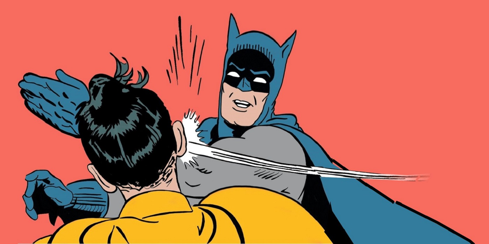

```{r setup, include=FALSE}
options(htmltools.dir.version = FALSE)
knitr::opts_chunk$set(warning = FALSE, message = FALSE, 
  comment = NA, dpi = 300, echo = FALSE,
  fig.align = "center", out.width = "80%", cache = FALSE)
library(tidyverse)
library(wesanderson)
library(gganimate)
```

class: title-slide, top, left
background-image: url(img/esteban-lopez-482075-unsplash.jpg)
background-size: cover


# `r rmarkdown::metadata$title`

### `r rmarkdown::metadata$author`

### rstd.io/blogdown-sdss

.footnote[

]

---
name: hello
class: inverse, right, middle


# Find me at...

[`r icon::fa("twitter")` @apreshill](http://twitter.com/apreshill)  
[`r icon::fa("github")` @apreshill](http://github.com/apreshill)  
[`r icon::fa("link")` alison.rbind.io](https://alison.rbind.io)  
[`r icon::fa("paper-plane")` alison@rstudio.com](mailto:alison@rstudio.com)

---
name: resume

###RESUME


.right-column[

+ Technically trained and skilled justice seeker with over 15 years hands-on experience fighting crime in an urban metropolis.

+ Highly motivated individual with proven success and drive against the war on crime.

+ Direct staff training to ensure timely assistance with law enforcement goals.

+ Demonstrated proficiency in the areas of intellect, detective skills, science and technology, physical prowess, and martial arts.
]

???

I want to start with a highly artificial example.

Here is a resume from a potential applicant for a job, and I'll just read these bullet points aloud...

This person may be the perfect person for my job. But these bullet points may not be that different from the other 5, 10, 50 applicants I have for the same job. How can they stand out?

Well one way is to find out is to give me something I can remember.

You may have heard that a picture is worth 1000 words. If you buy that, then a good story to go along with it is worth at least 1000 more words.

And it didn't have to be this way right? The same words could be used to accurately sum up another applicant...

---
template: resume

.left-column[


]

---
template: resume

.left-column[


]

---
background-image: url(img/jean-philippe-delberghe-640668-unsplash.jpg)
background-size: cover
class: top, right, inverse

## "I web, therefore I am ~~a spiderman~~."

##[- Yihui Xie](https://bookdown.org/yihui/blogdown/)


???

This example reminds me of one of my favorite quotes from Yihui Xie, the creator of the blogdown package and many other workflow changing R packages and that is:


---
name: blogdown
class: inverse, middle, center

# What is blogdown?

---
template: blogdown

```{r out.width="25%", echo = FALSE}
knitr::include_graphics("https://raw.githubusercontent.com/rstudio/hex-stickers/master/PNG/blogdown.png")
```


---
template: blogdown

--

An <i class="fab fa-r-project"></i> package...

--

that lets you create websites in 


???

So what is blogdown?

It is an R package... can I get a show of hands for everyone here who uses R? OK keep them up...

That lets you create websites in RStudio...can I get all of you R users to keep your hand up if you use RStudio, so lower your hand if you don't use RStudio

Perfect, thanks! So this is one of the first perks of blogdown, which is that you can build a website in the RStudio IDE using tools you are familiar with, and you won't need very much else to start.

---


??? 

The package helps you to use a static site generator named Hugo. If you didn't understand much of the last sentence I said, that is OK! The main thing you'll want to know is that Hugo gives you over 100 themes to choose from, so you can create a custom-looking website, in the same way that Wordpress offers website themes.

One difference here is that you own your content, and the entire pipeline for creating it, from start to finish, which I think is a huge benefit to users. You control what, you control when, you control how.


---
class: center, middle

# .shout[Bonus!]


```{r out.width="50%", echo = FALSE}

```

--


# .shout[You can use R Markdown!]


???

And a bonus is that because blogdown is built on top of R Markdown, you can include code and output in your website content.

This means you can include R code, but also Python, Julia, C++, any language engine supported in R Markdown.

This makes blogdown ideal for data scientists.

So what does a blogdown site look like?

---
background-image: url(img/amber.png)
background-size: contain

---
background-image: url(img/rudeboybert.png)
background-size: contain
  
---
background-image: url(img/emi-showcase.gif)
background-size: cover


---
class: inverse, middle, center

# Adventures in teaching blogdown

--

## Principles & Practice of Data Visualization

## Oregon Health & Science University, CS631 

---

class: middle, center, inverse

# First dataviz class, 2015

--


???

Taught all dataviz principle, no practice

Their response? We want hands-on labs! We want ggplot2! 

---
class: middle, center, inverse

# Second dataviz class, 2016

--


???

So we added weekly `ggplot2` labs, change lives

But...

---
class: middle, center, inverse

# Second dataviz class, 2016

--

## The final presentation

--


???

Students fumble all over themselves on how to share their plots! how to turn them in, how to present in slidedeck

---
class: middle, center, inverse

# What did we miss? `r emo::ji("target")`

--

> *We need to imagine new approaches...*

--

> *That entails shifting our emphasis away from individual charts to the construction, evaluation and delivery of the .large[.fancy[products where those charts appear]].*

--

.footnote[From [_3rd Wave Data Visualization_](https://towardsdatascience.com/3rd-wave-data-visualization-824c5dc84967) by [Elijah Meeks](http://elijahmeeks.com/#about)]

---
class: middle, center, inverse

# Third time is a charm! 2018


--


--

# You can help your students look awesome

???

So what did we do differently the third time around?

We decided to actually *teach* how to "wrap up" your data viz into a website 

---

# The final project

--

+ 1 shareable website

--

+ 1 about/bio page

--

+ 3 dataviz-focused blog posts

--

+ 15 minute verbal presentation of one post

---
class: middle, center, inverse

# So . . . how did it go?

--


---
class: middle, center, inverse

# What is hard about teaching blogdown?

--

```{r out.width="50%", echo = FALSE}

```


???

So what was hard about teaching blogdown? Turns out a lot!

---

# Lessons learned

.pull-left[

`r emo::ji("x")` I thought I had to *also* teach Git/GitHub (wrong)


`r emo::ji("x")` I thought I had to *also* teach continuous deployment (wrong x2)

`r emo::ji("x")` I didn't deploy soon enough (wrong x3)

]

--

.pull-right[

`r emo::ji("check")` I made everyone use the same Hugo theme

`r emo::ji("check")` I created the site live with them

`r emo::ji("check")` I showed them how to publish their sites! `r emo::ji("rocket")`

]

---
background-image: url(img/netlify-drop.png)
background-size: contain

---
background-image: url(img/book.png)
background-size: contain


---
# Learning objectives 

1. .shout[Showcase] your data science skills and projects with a shareable website

--

1. .shout[Understand] the relationship between files on your computer and the internet, and how to connect the two

--

1. .shout[Build and deploy] a static website and edit and create new content

--

1. .shout[Communicate] effectively about data and code with words and visualizations using a medium **that scales** beyond the classroom

---
name: thanks
class: middle, right, inverse


# Thank you!

[`r icon::fa("twitter")` @apreshill](http://twitter.com/apreshill)  
[`r icon::fa("github")` @apreshill](http://github.com/apreshill)  
[`r icon::fa("link")` alison.rbind.io](https://alison.rbind.io)  
[`r icon::fa("paper-plane")` alison@rstudio.com](mailto:alison@rstudio.com)  
[`r icon::fa("laptop-code")` slides](rstd.io/blogdown-sdss)  
[`r icon::fa("code")` code for slides](https://github.com/apreshill/talks)  
[`r icon::fa("camera-retro")` graphics](https://vecteezy.com)  

