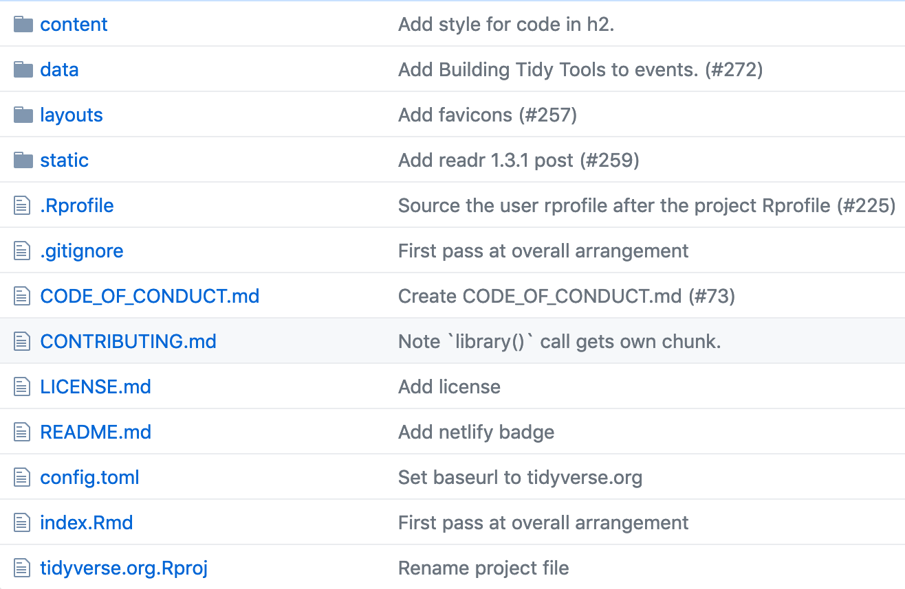
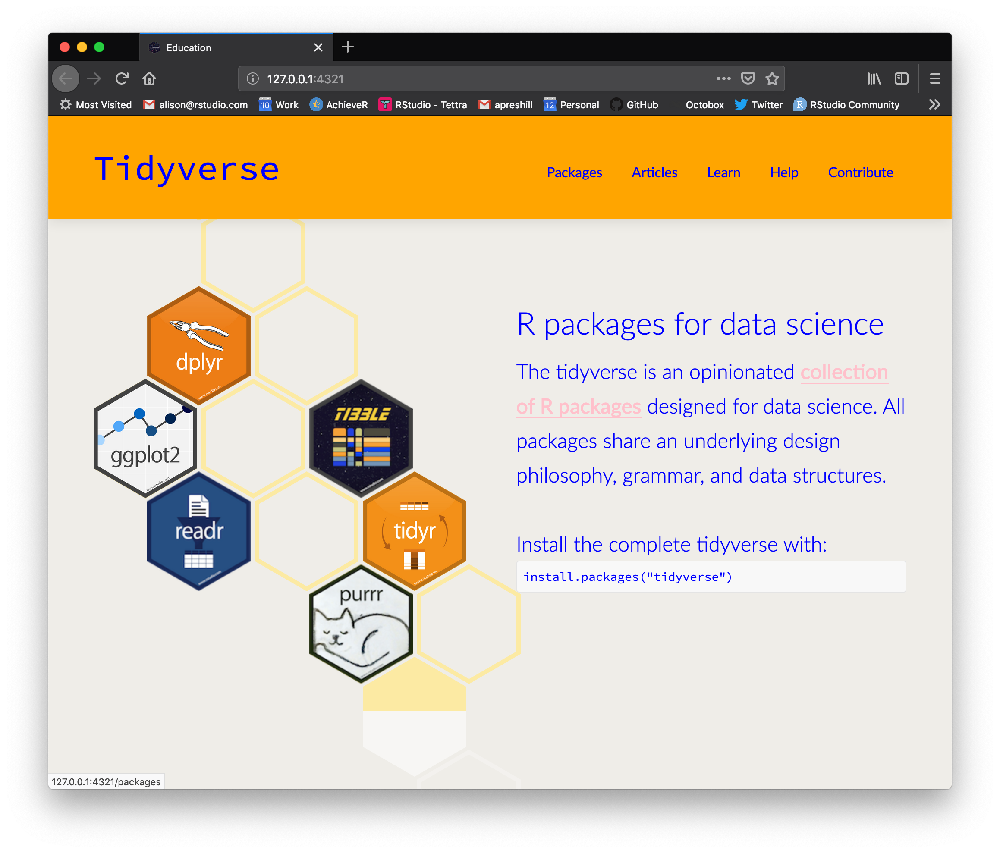
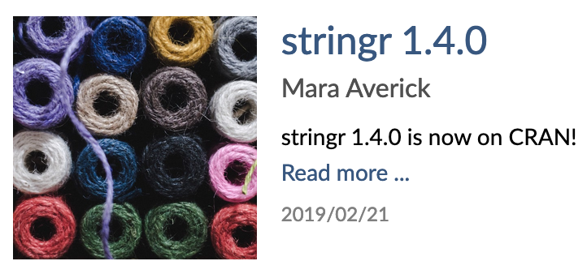
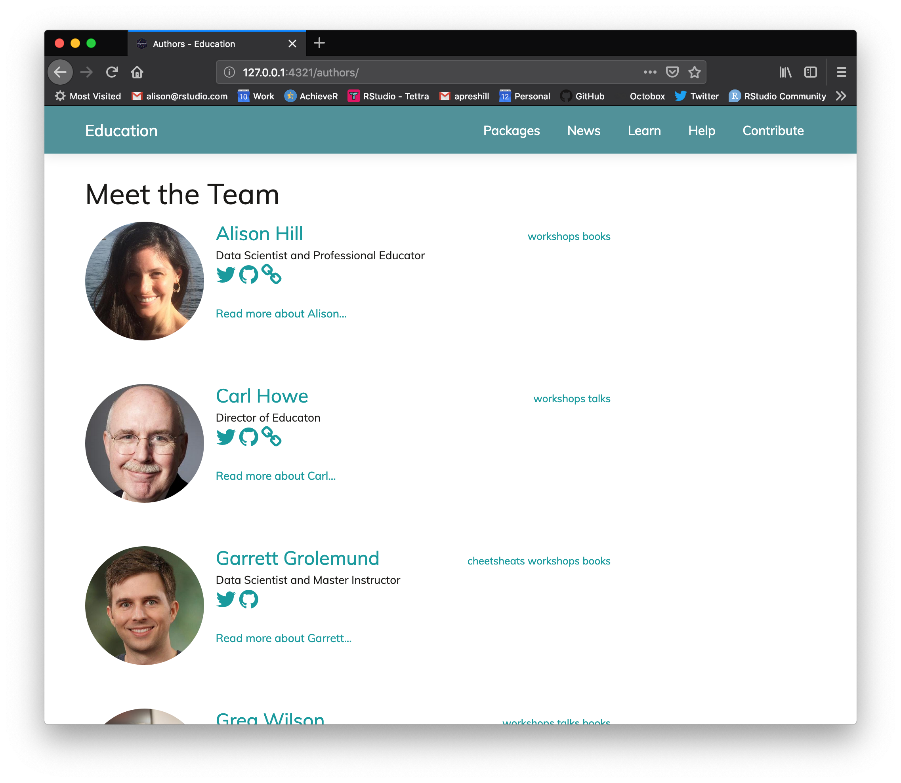
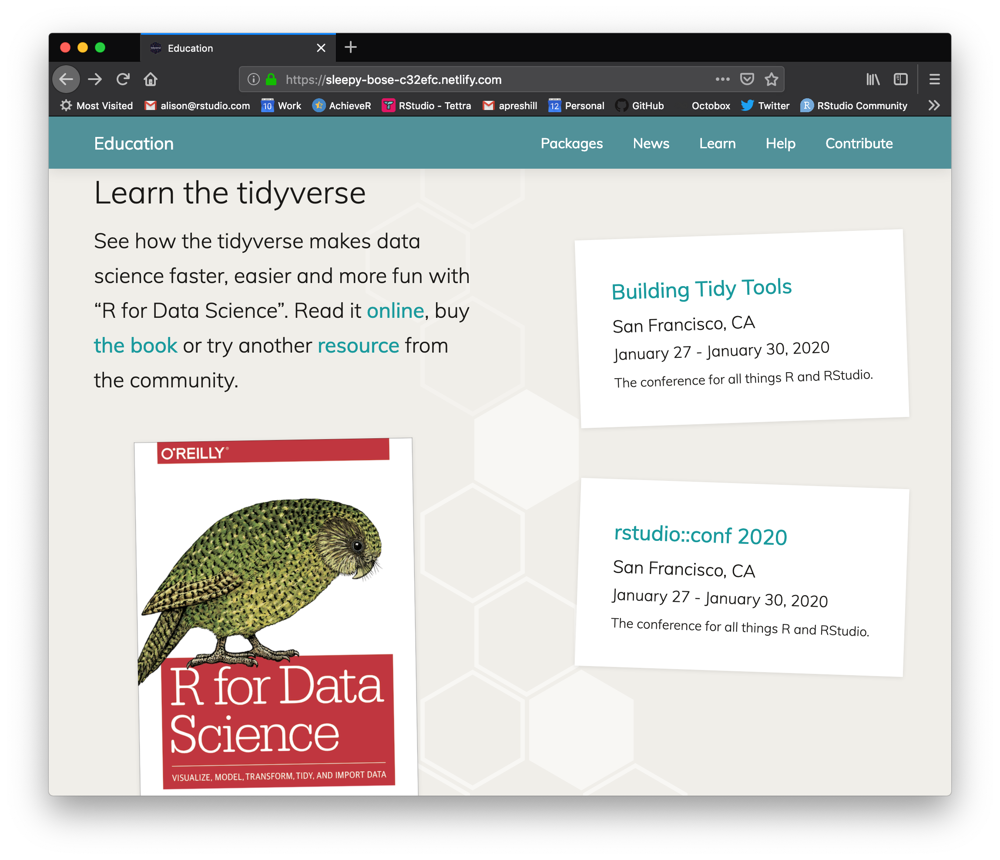
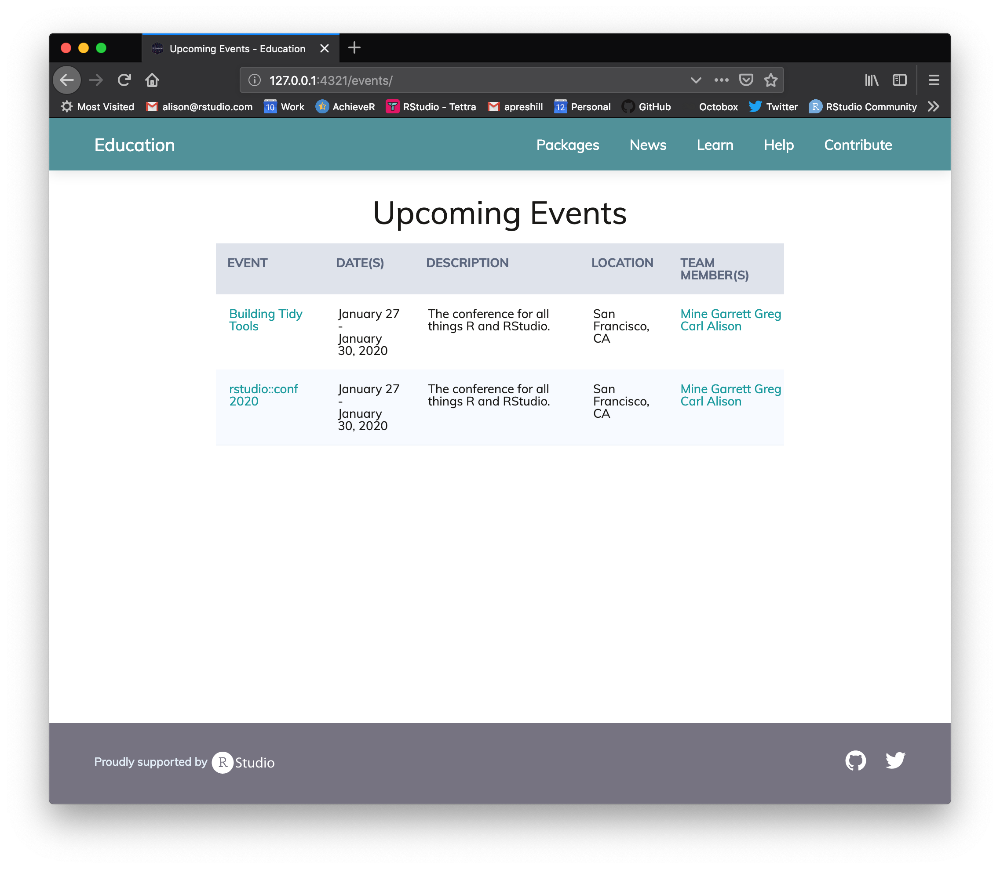

```{r setup, include=FALSE}
options(htmltools.dir.version = FALSE)
knitr::opts_chunk$set(warning = FALSE, message = FALSE, 
  comment = NA, dpi = 300, echo = FALSE,
  fig.align = "center", out.width = "80%", cache = FALSE)
library(tidyverse)
library(wesanderson)
library(gganimate)
```


# Edu Team Wishlist

+ We want something we can maintain ourselves,

--

+ We want to look consistent with other RStudio sites on the outside, and

--

+ We want to be consistent on the inside so that we can get help if/when we need it.


---
class: inverse, center, middle

# Goal 0

https://github.com/tidyverse/tidyverse.org


---
class: center, middle, inverse




---

# Goal 0: Takeaways

+ Need to make a theme that can be downloaded with `blogdown::new_site()`
  + all the typical Hugo theme folders in a single repo
  + plus an `exampleSite`
  

--

+ Want to use:
  + archetypes (templates for new content), 
  + [page bundles](https://gohugo.io/content-management/page-bundles/) (dealing with article images looks painful),
  + [authors/team members](https://www.netlify.com/blog/2018/07/24/hugo-tips-how-to-create-author-pages/) (listed but not linked),
  + [events](https://gohugo.io/templates/introduction/#example-show-only-upcoming-events) (only present in "stickies" pulling from `data/events.yml`)
  + `config.toml` to customize CSS (i.e., colors)
  + latest Hugo standards ([base templates and blocks](https://gohugo.io/templates/base/), [configuration directories](https://gohugo.io/getting-started/configuration/#configuration-directory), [page resources](https://gohugo.io/content-management/page-resources/))

---

# Goal 1: make it a theme

.pull-left[
### Before:

No "theme" folder
]

--

.pull-right[
### After:


- `themes/rstudio-lithium`
  - `archetypes/`
  - `layouts/`
  - `static/` (where I wanted all css, js, icons, and fonts)
]

---

# Goal 2: parameterize style


.pull-left[
### Before:

`static/css/tidyverse-site.css`


```css
a {
  color: #4c83b6;
  text-decoration: none;
  cursor: pointer; }
  a:hover {
    color: #42709b;
text-decoration: underline; }
```
]

--

.pull-right[
### After:

```css
/* Links */
a {
  color: {{ .Param "colors.link" }};
}
a:hover {
  color: {{ .Param "colors.link_hover" }};
}
```

+ Set colors as variables in site configuration params (`config/_default/params.toml`)

+ A partial layout reads these variables (`themes/my-theme/layouts/partials/custom-site.css`)

]

---
class: center, middle, inverse



---

```toml
# these colors get applied by layouts/partials/custom-site.css
# then, the layouts/partials/head_includes.html uses that partial
# the partial head_includes.html is called in the partial header.html everywhere!
```

.pull-left[
`config/_default/params.toml`
```toml
[colors]
    text = "#1a1917" # black
    # Links
    link = "#1a9a9d"
    link_hover = "#1a9a9d"
    # Footer
    footer_primary = "#767381" 
    footer_text = "#e3eef8" 
    # Backgrounds
    background = "white"
    home_section_odd = "white"
    home_section_even = "#f0eee9"
    # Menu
    menu_primary = "#519199"
    menu_text = "#fff"
    menu_text_active = "#fff"
    menu_title = "#fff"
    menu_title_active = "#deef03"
    menu_box_hover = "#7db3ba"
    menu_box_active = "white"
```
]

.pull-right[
`themes/my-theme/layouts/partials/custom-site.css`
```css
body {
	background-color: {{ .Param "colors.background" }};
	color: {{ .Param "colors.text" }}
}

/* Links */

a {
  color: {{ .Param "colors.link" }};
}

a:hover {
  color: {{ .Param "colors.link_hover" }};
}
```
]

---
class: center, middle, inverse


---

# Goal 3: parameterize content

Lots of content was present only in the .html files. 

Plan: 

+ move all content to `content/`
  + all site content has to be a variable or a parameter
  + made all individual `index.md` files into `folder/index.md` (cleaner for images)
  + new folders for `home/`, `authors/`, and `events/`

+ heavily edit `theme/layouts/`
  + added some partials (now: `meta`, `sidebar`, `events_sticky`, `calendar`, `head_includes`)
  + edited default layouts to include `baseof.html` and blocks

---

# Goal 3: the index.html

.pull-left[

### Before

`layouts/index.html`


```html

{{ partial "header.html" . }}

<!-- page -->
<div id="homeContent" class="pushFooter">
  <div class="band first">
    <div class="bandContent">
      <div class="hexBadges">
        <a href="http://purrr.tidyverse.org/"></a>
        <a href="http://ggplot2.tidyverse.org/"></a>
        <a href="http://dplyr.tidyverse.org/"></a>
        <a href="http://tidyr.tidyverse.org/"></a>
        <a href="http://readr.tidyverse.org/"></a>
        <a href="http://tibble.tidyverse.org/"></a>
</div>

```
]

--

.pull-right[
### After

`content/home/band_one.md`

```yaml
---
title: "R packages for Data Science"
col0:
  row1: "dplyr"
  row2: "ggplot2"
  row3: "readr"
col2:
  row2: "tibble"
  row3: "tidyr"
  row4: "purrr"
---
```

This will work for any .PNG file in the [rstudio/hex-stickers](https://github.com/rstudio/hex-stickers/tree/master/PNG) GitHub repo.


]


---

# Add authors

.pull-left[
### Before:

+ Shows up for articles in list



+ Not listed within the article

+ Multiple authors not possible
]


--

.pull-right[
### After:

+ Allow multiple authors in both list and single article formats

+ Enable authors taxonomy in both `list.html` and `single.html` partial layouts so authors can link back to "author" page

+ "Meet the Team" page

```
{{- range .Params.authors }}
   ={{- with $.Site.GetPage "taxonomyTerm" 
   (printf "authors/%s" (urlize .)) }}
{{ end }}
```

]

---
class: center, middle, inverse

https://sleepy-bose-c32efc.netlify.com/authors/




---

# Events

.pull-left[
### Before:

`data/events.yaml`

```yaml
- url: https://www.rstudio.com/conference/
  title: rstudio::conf 2020
  where: San Francisco, CA
  when:  Jan 27-30
  iso8601: 2020-01-30
  what: |
    rstudio::conf 2020 covers all things RStudio, including workshops to
    teach you the tidyverse, and talks to show you the latest and greatest
    features.
```

]

.pull-right[
### After:

`contents/events/rstudio-conf-2020.md`

```yaml
---
title: "rstudio::conf 2020"
date: "2019-02-15"
date_start: "2020-01-27"
date_end: "2020-01-30"
description: >
  The conference for all things R and RStudio.
event_url: "https://www.rstudio.com/conference/"
location: "San Francisco, CA"
educators:
  - Mine
  - Garrett
  - Greg
  - Carl
  - Alison
---
```

<blurb here>

]

---

# Add upcoming events


.pull-left[




]

--

.pull-right[




https://sleepy-bose-c32efc.netlify.com/events/

]

---

# To-do list

+ Add archetypes
  - add author, event, news item
  
+ More work on image processing/resizing for lists/single layouts
  
+ Need to extend custom CSS parameters to fonts, especially font sizes for code/headers/body/etc.

+ Enable search (probably has to be with lunr.js)

+ Build out separate repo with the final theme

  + Make an example site
  
  + Write up some internal documentation for how to use

+ Curate __content__ `r emo::ji("tada")`
  + For edu team, add landing page "personas" ([mockup](https://add-personas--sleepy-bose-c32efc.netlify.com/))


