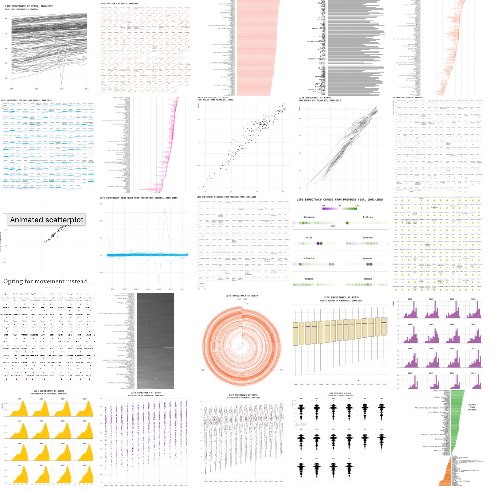

```{r setup, include=FALSE}
options(htmltools.dir.version = FALSE)
knitr::opts_chunk$set(warning = FALSE, message = FALSE, 
  comment = NA, dpi = 300,
  fig.align = "center", out.width = "70%", cache = FALSE)
library(tidyverse)
library(here)
library(knitr)
library(emo)
library(extrafont)
# ggplot2::theme_set(theme_minimal())
# update those defaults
update_font_defaults <- function(font_choice = "Lato") {

    ggplot2::update_geom_defaults("text", list(family = font_choice))
    ggplot2::update_geom_defaults("label", list(family = font_choice))
    
}

theme_bakeoff <- function(font_choice = "Lato"){ 
  
  update_font_defaults()
  
  ggplot2::theme_minimal(base_family = font_choice)
  
}
ggplot2::theme_set(theme_bakeoff())
```


class: center, middle, inverse

# Inspired by:

## [Flowing Data: One Dataset Visualized 25 Ways](https://flowingdata.com/2017/01/24/one-dataset-visualized-25-ways/)

```{r echo = FALSE}

```


---
class: center, middle, inverse

## Disclaimers

--

I am a data visualization .whisper[practioner]. 

--

I offer what I hope are well-reasoned opinions here, but obviously .whisper[YMMV].

--

I do not claim that all of the following are .whisper[good] nor .whisper[publication-worthy] visualizations (for those viewing these slides without narrative)


---
class:middle, inverse, center

## My messages for today

---
class:middle, inverse, center

## tidiness $\neq$ .shout[godliness]


---
class:middle, inverse, center

## tidiness = .whisper[nimbleness]


---
class:middle, inverse, center

## tidy $\neq$ .shout[done]


---
class:middle, inverse, center

```{r echo = FALSE}
knitr::include_graphics("img/tidyverse_wrangle.png")
```

---
class: center, middle, inverse

## But also...

Don't be afraid to chop out those `ggplot2` defaults! 


---
class: center, middle, inverse

## But also...

It's all in the details.


---
# Packages first

I'll use all of the following:

```{r}
library(tidyverse)
library(bakeoff) # data + colors!
```

---
# Data second

```{r}
library(bakeoff)
ratings <- ratings_seasons %>% 
  mutate(series = as.factor(series))
```

---
# Glimpse

```{r echo = FALSE, highlight.output = 6}
glimpse(ratings)
```


---
class: center, middle, inverse

# `r emo::ji("cake")`

## Recipe 1: Continuous Bar Chart

---
## Recipe 1: Continuous Bar Chart

```{r episodebar, echo = FALSE, out.width = '70%'}
# create continuous episode count
plot_off1 <- ratings %>% 
  mutate(ep_id = row_number()) %>% #<<
  select(ep_id, viewers_7day, series, episode)

# create coordinates for labels
series_labels <- plot_off1 %>% 
  group_by(series) %>% 
  summarize(y_position = median(viewers_7day) + 1,
            x_position = mean(ep_id))

# make the plot
ggplot(plot_off1, aes(x = ep_id, y = viewers_7day, fill = series)) + #<<
  geom_col(alpha = .9) + #<<
  ggtitle("Series 8 was a Big Setback in Viewers",
          subtitle= "7-Day Viewers across All Series/Episodes") +
  geom_text(data = series_labels, aes(label = series,
                                      x = x_position, 
                                      y = y_position)) +
  theme(axis.text.x = element_blank(),
        axis.ticks.x = element_blank(),
        axis.title.x = element_blank(),
        panel.grid.major.x = element_blank(),
        panel.grid.minor.x = element_blank()) + 
  scale_fill_bakeoff(guide = FALSE) +
  scale_x_continuous(expand = c(0, 0)) 
```

---
## Recipe 1: Questions

.left-column[
1. Which .whisper[dataset]?
1. Which .whisper[geom]?
1. What .whisper[variable] is mapped on the .shout[x-axis]?
1. What .whisper[variable] is mapped on the .shout[y-axis]?
1. What .whisper[variable] is mapped to .shout[color]?
]

.right-column[
```{r episodebar, echo = FALSE}
```
]

---
## Recipe 1: Code for Bar Chart

```{r episodebar, eval = FALSE}
```

---
class: center, middle, inverse

# `r emo::ji("cake")`

## What is going on with Series 8?

> *"The eighth series of The Great British Bake Off began on 29 August 2017, with this being the first of The Great British Bake Off to be broadcast on Channel 4, after the production company Love Productions moved the show. It is the first series for new hosts Noel Fielding and Sandi Toksvig, and new judge Prue Leith." -- <a href="https://en.wikipedia.org/wiki/The_Great_British_Bake_Off_(series_8)">Wikipedia</a>*

---
class: center, middle, inverse


## Read: 

--

## No Mary Berry, no Mel, no Sue

---
class: center, middle, inverse

# `r emo::ji("cake")`

## Recipe 2: Lollipop Plot

---

## Recipe 2: Lollipop Plot

```{r lolli, echo = FALSE}
plot_off2 <- ratings %>% 
  group_by(series) %>% #<<
  mutate(series_avg = mean(viewers_7day, na.rm = TRUE), #<<
         diff_avg = viewers_7day - series_avg) %>% #<<
  filter(max(episode) == 10) %>% 
  mutate(episode = as.factor(episode)) %>% 
  select(episode, viewers_7day, series, diff_avg, series_avg)

ggplot(plot_off2, aes(x = episode, y = viewers_7day, color = diff_avg)) + #<<
  geom_hline(aes(yintercept = series_avg), alpha = .5) + #<<
  geom_point() + #<<
  geom_segment(aes(xend = episode, yend = series_avg)) + #<<
  facet_wrap(~series) + #<<
  scale_color_viridis_c(option="plasma", begin = 0, 
                      end = .8, guide = FALSE) +
  ggtitle("Great British Bake Off Finales Get the Most Viewers",
          subtitle = "Way Higher than Series Average (for Series with 10 episodes)")
```

---
## Recipe 2: Questions

.left-column[
1. Which .whisper[dataset]?
1. Which .whisper[3 geoms]?
1. What .whisper[variable] is .shout[facet wrapped]?
1. What .whisper[variable] is mapped on the .shout[x-axis]?
1. What .whisper[variable] is mapped on the .shout[y-axis]?
1. What .whisper[variable] is mapped to .shout[color]?
]

.right-column[
```{r lolli, echo = FALSE}
```
]
---

## Recipe 2: Code for Lollipop Plot

```{r lolli, eval = FALSE}
```


---
class: center, middle, inverse

# `r emo::ji("cake")`

## Recipe 3: Series Line Plot

---
## Recipe 3: Series Line Plot

```{r serieslines, echo = FALSE, out.width='70%'}
line_labels <- ratings %>% 
  group_by(series) %>% 
  filter(episode == max(episode)) %>% 
  select(series, x_position = episode, y_position = viewers_7day)

ggplot(ratings, aes(x = as.factor(episode), #<<
                    y = viewers_7day, #<<
                    color = as.factor(series), #<<
                    group = series)) + #<<
  geom_line() + #<<
  scale_color_bakeoff(guide = FALSE) +
  labs(color = "Series", x = "Episode") +
  geom_text(data = line_labels, aes(label = series,
                                      x = x_position + .25, 
                                      y = y_position)) 
```

---
## Recipe 3: Questions

.left-column[
1. Which .whisper[dataset]?
1. Which .whisper[geom]?
1. What .whisper[variable] is .shout[grouped]?
1. What .whisper[variable] is mapped on the .shout[x-axis]?
1. What .whisper[variable] is mapped on the .shout[y-axis]?
1. What .whisper[variable] is mapped to .shout[color]?
]

.right-column[
```{r serieslines, echo = FALSE}
```
]
---
## Recipe 3: Code for Series Line Plot

```{r serieslines, eval = FALSE}
```


---
class: center, middle, inverse

# `r emo::ji("cake")`

## Recipe 4: Facetted Line Plot

---
## Recipe 4: Facetted Line Plot

```{r facetlines, echo = FALSE, out.width='70%'}
ggplot(ratings, aes(x = as.factor(episode), #<<
                    y = viewers_7day, #<<
                    color = fct_reorder2(series, episode, viewers_7day), #<<
                    group = series)) + #<<
  facet_wrap(~series) + #<<
  geom_line(lwd = 2) + #<<
  scale_color_bakeoff(guide = FALSE) +
  labs(color = "Series", x = "Episode") 
```

---
## Recipe 4: Questions

.left-column[
1. Which .whisper[dataset]?
1. Which .whisper[geom]?
1. What .whisper[variable] is .shout[facetted]?
1. What .whisper[variable] is .shout[grouped]?
1. What .whisper[variable] is mapped on the .shout[x-axis]?
1. What .whisper[variable] is mapped on the .shout[y-axis]?
1. What .whisper[variable] is mapped to .shout[color]?
]

.right-column[
```{r facetlines, echo = FALSE}
```
]
---
## Recipe 4: Code for Facetted Line Plot

```{r facetlines, eval = FALSE}
```

---
class: center, middle, inverse

# `r emo::ji("cake")`

## Recipe 5: First vs. Last

---
## Recipe 5: First vs. Last

```{r firstlastline, echo = FALSE, out.width='60%'}
# some wrangling here
plot_off5 <- ratings %>% 
  select(series, episode, viewers_7day) %>% 
  group_by(series) %>% #<<
  filter(episode == 1 | episode == max(episode)) %>% #<<
  mutate(episode = recode(episode, `1` = "first", .default = "last")) %>% #<<
  ungroup()

# code for plot
ggplot(plot_off5, aes(x = series, #<<
                      y = viewers_7day,#<<
                      color = fct_reorder2(episode, series, viewers_7day), #<<
                      group = episode)) + #<<
  geom_point() + #<<
  geom_line() + #<<
  scale_color_bakeoff() +
  ggtitle("Great British Bake Off Finales Get More Viewers than Premieres") +
  labs(color = "Episode")
```

---
## Recipe 5: Questions

.left-column[
1. Which .whisper[dataset]?
1. Which .whisper[geoms]?
1. What .whisper[variable] is .shout[grouped]?
1. What .whisper[variable] is mapped on the .shout[x-axis]?
1. What .whisper[variable] is mapped on the .shout[y-axis]?
1. What .whisper[variable] is mapped to .shout[color]?
]

.right-column[
```{r firstlastline, echo = FALSE}
```
]
---
## Recipe 5: Code for First vs. Last

```{r firstlastline, eval = FALSE}
```

---
class: center, middle, inverse

# `r emo::ji("cake")`

## What is going on with the Series 8 finale?

---
class: middle, center, inverse

## A [tweet](https://twitter.com/PrueLeith/status/925329937644564480) heard 'round the world

<blockquote class="twitter-tweet" data-lang="en"><p lang="en" dir="ltr">I am so sorry to the fans of the show for my mistake this morning, I am in a different time zone and mortified by my error <a href="https://twitter.com/hashtag/GBBO?src=hash&amp;ref_src=twsrc%5Etfw">#GBBO</a>.</p>&mdash; Prue Leith (@PrueLeith) <a href="https://twitter.com/PrueLeith/status/925329937644564480?ref_src=twsrc%5Etfw">October 31, 2017</a></blockquote>


---
class: center, middle, inverse

# `r emo::ji("cake")`

## Recipe 6: Dumbbell Plot

---
## Recipe 6: Dumbbell Plot


```{r dumbbell, echo = FALSE, out.width='60%'}
ggplot(plot_off5, aes(x = viewers_7day, #<<
                      y = fct_rev(series),  #<<
                      color = episode,  #<<
                      group = series)) + #<<
  geom_line(size = .75) + #<<
  geom_point(size = 2.5) + #<<
  scale_color_bakeoff() +
  labs(y = "Series", x = "Viewers (millions)", color = "Episode") +
  ggtitle("Great British Bake Off Finales Get More Viewers than Premieres") 
```

---
## Recipe 6: Questions

.left-column[
1. Which .whisper[dataset]?
1. Which .whisper[geoms]?
1. What .whisper[variable] is .shout[grouped]?
1. What .whisper[variable] is mapped on the .shout[x-axis]?
1. What .whisper[variable] is mapped on the .shout[y-axis]?
1. What .whisper[variable] is mapped to .shout[color]?
]

.right-column[
```{r dumbbell, echo = FALSE}
```
]
---
## Recipe 6: Code for Dumbbell Plot


```{r dumbbell, eval = FALSE}
```

---
class: center, middle, inverse

# `r emo::ji("cake")`

## Recipe 7: Slope Graph

---
## Recipe 7: Slope Graph 


```{r slope, echo = FALSE, out.width='65%'}
slope_labels <- plot_off5 %>% 
  filter(episode == "last") %>% 
  select(series, x_position = episode, y_position = viewers_7day)

ggplot(plot_off5, aes(x = episode, #<<
                      y = viewers_7day, #<<
                      color = series, #<<
                      group = series)) + #<<
  geom_point() + #<<
  geom_line() + #<<
  scale_color_bakeoff(guide = FALSE) +
  geom_text(data = slope_labels, aes(label = series,
                                    x = x_position,
                                    y = y_position),
            nudge_x = .1) +
  theme(panel.grid = element_blank(),
        axis.line = element_line(color = "gray"))
```

---
## Recipe 7: Questions

.left-column[
1. Which .whisper[dataset]?
1. Which .whisper[geoms]?
1. What .whisper[variable] is .shout[grouped]?
1. What .whisper[variable] is mapped on the .shout[x-axis]?
1. What .whisper[variable] is mapped on the .shout[y-axis]?
1. What .whisper[variable] is mapped to .shout[color]?
]

.right-column[
```{r slope, echo = FALSE}
```
]
---
## Recipe 7: Code for Slope Graph

```{r slope, eval = FALSE}
```


---
class: center, middle, inverse

# `r emo::ji("cake")`


## Recipe 8: Finale "Bumps"

---
## Recipe 8: Finale "Bumps"

```{r bump, echo = FALSE, out.width='70%'}
# some more serious wrangling here
plot_off8 <- ratings %>% 
  select(series, episode, viewers_7day) %>% 
  group_by(series) %>% 
  filter(episode == 1 | episode == max(episode)) %>% 
  mutate(episode = recode(episode, `1` = "first", .default = "last")) %>%  #<<
  spread(episode, viewers_7day) %>% #<<
  mutate(finale_bump = last - first) #<<

# plot
ggplot(plot_off8, aes(x = fct_rev(series), #<<
                      y = finale_bump)) + #<<
  geom_col(fill = bakeoff_cols("baltic"), alpha = .7) + #<<
  coord_flip() + #<<
  labs(x = "Series", y = "Difference in Viewers for Finale from Premiere (millions)") +
  ggtitle("Finale 'Bumps' were Smallest for Series 1 and 8",
          subtitle = "Finale 7-day Viewers Relative to Premiere")
```

---
## Recipe 8: Questions

.left-column[
1. Which .whisper[dataset]?
1. Which .whisper[geom]?
1. What .whisper[variable] is mapped on the .shout[x-axis]?
1. What .whisper[variable] is mapped on the .shout[y-axis]?
1. What .whisper[variable] is mapped to .shout[color]?
]

.right-column[
```{r bump, echo = FALSE}
```
]
---
## Recipe 8: Code for Finale "Bumps"

```{r bump, eval = FALSE}
```


---
class: center, middle, inverse

# `r emo::ji("cake")`

## Recipe 9: % Change Bar Chart

---
## Recipe 9: % Change Bar Chart

```{r changebar, echo = FALSE, out.width='70%'}
# wrangling to calculate percent change
plot_off9 <- ratings %>% 
  select(series, episode, viewers_7day) %>% 
  group_by(series) %>% 
  filter(episode == 1 | episode == max(episode)) %>% 
  ungroup() %>% 
  mutate(episode = recode(episode, `1` = "first", .default = "last")) %>% 
  spread(episode, viewers_7day) %>% #<<
  mutate(pct_change = (last - first) / first) #<<

# plot
ggplot(plot_off9, aes(x = fct_rev(series), #<<
                      y = pct_change)) + #<<
  geom_col(fill = bakeoff_cols("baltic"), alpha = .5) + #<<
  geom_hline(aes(yintercept = median(pct_change, na.rm = TRUE)), 
             color = bakeoff_cols("berry"),
             lwd = 2) +
  labs(x = "Series", y = "% Increase in Viewers, First to Last Episode") +
  ggtitle("Series 8 had a 6% Increase in Viewers from Premiere to Finale",
          subtitle= "The Lowest Across All Series (Line is the Median)") + 
  scale_y_continuous(labels = scales::percent) +
  coord_flip() 
```

---
## Recipe 9: Questions

.left-column[
1. Which .whisper[dataset]?
1. Which .whisper[geom]?
1. What .whisper[variable] is mapped on the .shout[x-axis]?
1. What .whisper[variable] is mapped on the .shout[y-axis]?
1. What .whisper[variable] is mapped to .shout[color]?
]

.right-column[
```{r changebar, echo = FALSE}
```
]
---
## Recipe 9: Code for % Bar

````{r changebar, eval = FALSE}
```


---
class: center, middle, inverse

# 🎂

## Recipe 10: Lollipop Plot, % Change

---
## Recipe 10: Lollipop Plot, % Change

```{r lollipercent, echo = FALSE, out.width='70%'}
# plot
ggplot(plot_off9, aes(x = fct_rev(series), #<<
                      y = pct_change)) + #<<
  geom_point(color = bakeoff_cols("bluesapphire"), size = 2) + #<<
  geom_segment(aes(xend = fct_rev(series), yend = 0), color = bakeoff_cols("bluesapphire")) + #<<
  geom_text(aes(label = scales::percent(pct_change)), hjust = -.25) +
  labs(x = "Series", y = "% Change in Viewers from First to Last Episode") +
  ggtitle("Percent Increase in Viewers was the Smallest for Series 8",
          subtitle= "Finale 7-day Viewers Relative to Premiere") +
  scale_y_continuous(labels = scales::percent, limits = c(0, .85)) +
  coord_flip() 
```

---
## Recipe 10: Code for % Lollipop Plot

```{r lollipercent, eval = FALSE}
```

---
class: center, middle, inverse


---
class: center, middle, inverse

# 🎂

## Recipe 11: Scatterplot

---
## Recipe 11: Scatterplot

```{r scatter, echo = FALSE}
ggplot(plot_off8, aes(x = first, y = last)) + #<<
  geom_point() + #<<
  geom_smooth(se = FALSE, color = '#EBBFDD') + #<<
  geom_abline(slope = 1, intercept = 0, color = "gray", alpha = .5) + #<<
  geom_text(aes(label = series), hjust = -1) +
  labs(x = "Premiere Episode 7-day Viewers (millions)",
       y = "Finale Episode 7-day Viewers (millions)") +
  coord_equal(ratio=1)
```

---
## Recipe 11: Code for Scatterplot

```{r scatter, eval = FALSE}
```

---
class: center, middle, inverse

# 🎂

## Recipe 11.1: Pop-Out Scatterplot

---
## Recipe 11.1: Pop-Out Scatterplot

```{r lollipop, echo = FALSE}
ggplot(plot_off8, aes(x = first, y = last)) +
  geom_abline(slope = 1, intercept = 0, color = "gray", alpha = .5) +
  geom_smooth(se = FALSE, color = "#11B2E8") +
  geom_point(data = filter(plot_off8, series %in% c(1:7))) +
  geom_point(data = filter(plot_off8, series == 8), colour = "#CF2154") +
  geom_text(data = filter(plot_off8, series %in% c(1:7)),
            aes(label = series), hjust = -1) +
  geom_text(data = filter(plot_off8, series == 8),
            aes(label = series), hjust = -1, colour = "#CF2154") +
  labs(x = "Premiere Episode 7-day Viewers (millions)",
       y = "Finale Episode 7-day Viewers (millions)")
```

---
## Recipe 11.1: Code for Pop-Out Scatterplot

```{r lollipop, eval = FALSE}
```

---
class:inverse, middle, center


